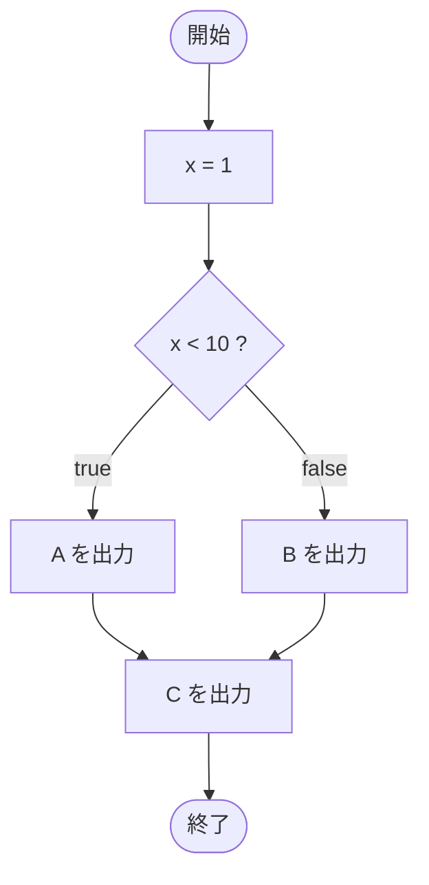

# Test0506 — フローチャートとトレース表

- 対象ファイル: `src/Test0506.java`
- パッケージ: デフォルト
- テーマ: `{}` を省略した `if-else` 文の動作確認。

## ソースの要点

```java
int x = 1;
if (x < 10)
    System.out.print("A");
else
    System.out.print("B");
System.out.print("C");
```

## フローチャート



## トレース表

| ステップ | 文 | x | 条件判定 | 出力 |
|---|---|---|---|---|
| 1 | `int x = 1` | 1 | - | - |
| 2 | `if (x < 10)` | 1 | `1 < 10` → true | - |
| 3 | `System.out.print("A")` | 1 | - | A |
| 4 | `System.out.print("C")` | 1 | - | C |

## 実行結果（標準出力）

```
AC
```

## 学習ポイント

- `{}` 省略時、if と else それぞれ直後の 1 文ずつが本体。
- if-else の後ろにある文（`C`）は分岐結果に関係なく常に実行される。
