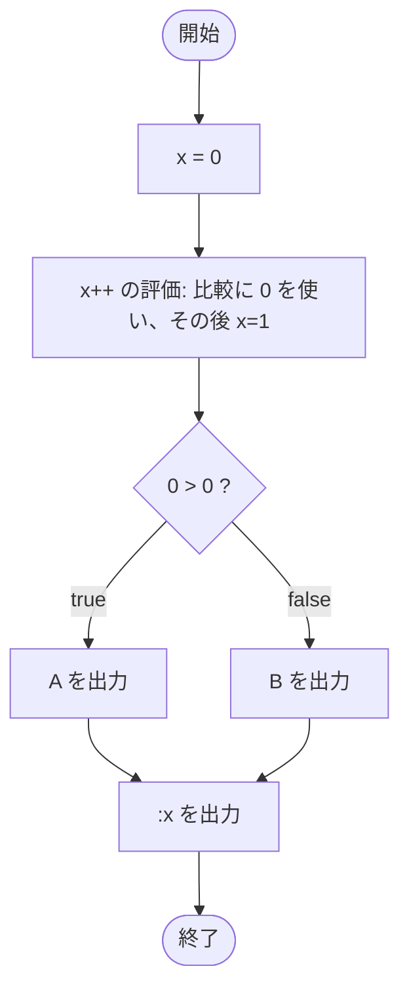

# Test0507 — フローチャートとトレース表

- 対象ファイル: `src/Test0507.java`
- パッケージ: デフォルト
- テーマ: 後置インクリメント `x++` の評価順序を学ぶ。条件式では古い値が使われ、後で 1 増える。

## ソースの要点

```java
int x = 0;
if (x++ > 0) {
    System.out.print("A");
} else {
    System.out.print("B");
}
System.out.print(":" + x);
```

## フローチャート



## トレース表

| ステップ | 文 | x | 条件判定 | 出力 |
|---|---|---|---|---|
| 1 | `int x = 0` | 0 | - | - |
| 2 | `if (x++ > 0)` 評価 | 0 → 1（後置で評価後にインクリメント） | `0 > 0` → false | - |
| 3 | `else` 実行 | 1 | - | - |
| 4 | `System.out.print("B")` | 1 | - | B |
| 5 | `System.out.print(":" + x)` | 1 | - | :1 |

## 実行結果（標準出力）

```
B:1
```

## 学習ポイント

- 後置 `x++` は「式の値として古い `x` を使い、その後 `x` を 1 増やす」。
- 条件判定では古い値 `0` が使われるので `0 > 0` で false。
- 比較後に x は 1 になっているので、最終出力で `:1` となる。
