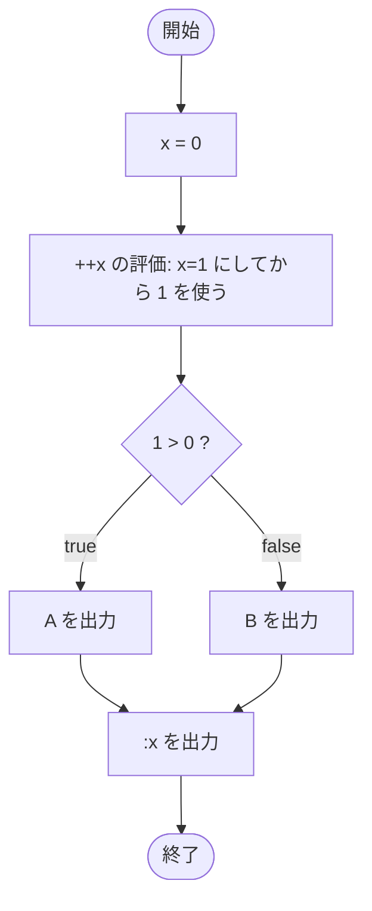

# Test0508 — フローチャートとトレース表

- 対象ファイル: `src/Test0508.java`
- パッケージ: デフォルト
- テーマ: 前置インクリメント `++x` の評価順序を学ぶ。条件式で 1 増えた値が使われる。

## ソースの要点

```java
int x = 0;
if (++x > 0) {
    System.out.print("A");
} else {
    System.out.print("B");
}
System.out.print(":" + x);
```

## フローチャート



## トレース表

| ステップ | 文 | x | 条件判定 | 出力 |
|---|---|---|---|---|
| 1 | `int x = 0` | 0 | - | - |
| 2 | `if (++x > 0)` 評価 | 1（前置で先にインクリメント） | `1 > 0` → true | - |
| 3 | `System.out.print("A")` | 1 | - | A |
| 4 | `System.out.print(":" + x)` | 1 | - | :1 |

## 実行結果（標準出力）

```
A:1
```

## 学習ポイント

- 前置 `++x` は「先に `x` を 1 増やしてから、その新しい値を式の値として使う」。
- `Test0507` との違いは、条件判定の時点で `x` が 1 か 0 か。
- 後置と前置で if の分岐結果が逆になることを確認する。
