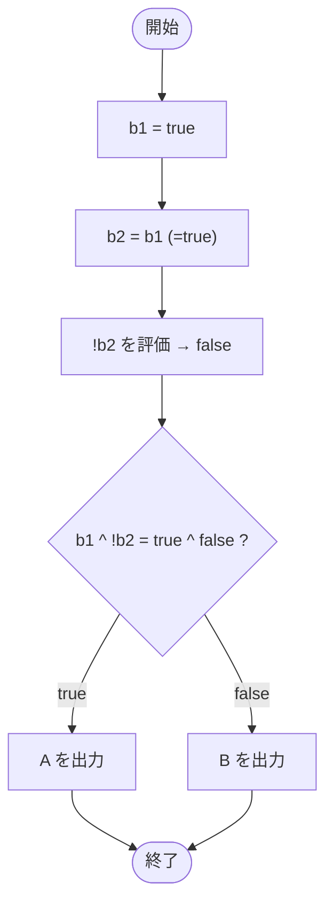

# Test0509 — フローチャートとトレース表

- 対象ファイル: `src/Test0509.java`
- パッケージ: デフォルト
- テーマ: 排他的論理和 `^` と論理 NOT `!` の組み合わせを学ぶ。

## ソースの要点

```java
boolean b1 = true;
boolean b2 = b1;
if (b1 ^ !b2) {
    System.out.print("A");
} else {
    System.out.print("B");
}
```

## フローチャート



## トレース表

| ステップ | 文 | b1 | b2 | 条件判定 | 出力 |
|---|---|---|---|---|---|
| 1 | `boolean b1 = true` | true | - | - | - |
| 2 | `boolean b2 = b1` | true | true | - | - |
| 3 | `if (b1 ^ !b2)` | true | true | `true ^ !true` = `true ^ false` = true | - |
| 4 | `System.out.print("A")` | true | true | - | A |

## 実行結果（標準出力）

```
A
```

## 学習ポイント

- `^` は排他的論理和（XOR）。2 つが異なるとき true。
- `true ^ false` は true、`true ^ true` や `false ^ false` は false。
- `!` で boolean を反転できる。
