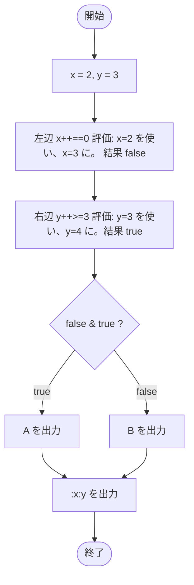

# Test0510 — フローチャートとトレース表

- 対象ファイル: `src/Test0510.java`
- パッケージ: デフォルト
- テーマ: 非短絡演算子 `&` の動作。両辺とも必ず評価されるため、副作用（`++`）が両方発生する。

## ソースの要点

```java
int x = 2, y = 3;
if (x++ == 0 & y++ >= 3) {
    System.out.print("A");
} else {
    System.out.print("B");
}
System.out.print(":" + x + ":" + y);
```

## フローチャート



## トレース表

| ステップ | 文 | x | y | 条件判定 | 出力 |
|---|---|---|---|---|---|
| 1 | `int x = 2, y = 3` | 2 | 3 | - | - |
| 2 | `x++ == 0` を評価 | 2 → 3 | 3 | `2 == 0` → false | - |
| 3 | `y++ >= 3` を評価（`&` は短絡しない） | 3 | 3 → 4 | `3 >= 3` → true | - |
| 4 | `false & true` | 3 | 4 | false | - |
| 5 | `else` 実行 → `System.out.print("B")` | 3 | 4 | - | B |
| 6 | `System.out.print(":" + x + ":" + y)` | 3 | 4 | - | :3:4 |

## 実行結果（標準出力）

```
B:3:4
```

## 学習ポイント

- `&` は **非短絡** の論理 AND。左辺が false でも右辺を必ず評価する。
- `++` の副作用が両方適用されるため、x と y が両方インクリメントされる。
- `&&` との違いを `Test0511` と比較して理解する。
