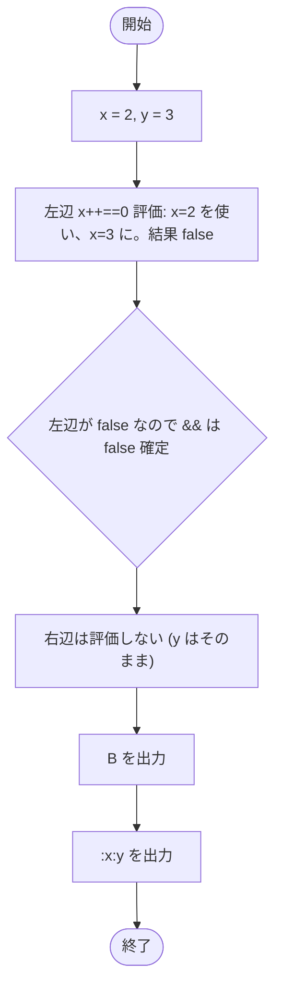

# Test0511 — フローチャートとトレース表

- 対象ファイル: `src/Test0511.java`
- パッケージ: デフォルト
- テーマ: 短絡演算子 `&&` の動作。左辺が false なら右辺は評価されず、副作用も発生しない。

## ソースの要点

```java
int x = 2, y = 3;
if (x++ == 0 && y++ >= 3) {
    System.out.print("A");
} else {
    System.out.print("B");
}
System.out.print(":" + x + ":" + y);
```

## フローチャート



## トレース表

| ステップ | 文 | x | y | 条件判定 | 出力 |
|---|---|---|---|---|---|
| 1 | `int x = 2, y = 3` | 2 | 3 | - | - |
| 2 | `x++ == 0` を評価 | 2 → 3 | 3 | `2 == 0` → false | - |
| 3 | `&&` 短絡 | 3 | 3 | 左辺 false → 右辺評価せず | - |
| 4 | `else` 実行 → `System.out.print("B")` | 3 | 3 | - | B |
| 5 | `System.out.print(":" + x + ":" + y)` | 3 | 3 | - | :3:3 |

## 実行結果（標準出力）

```
B:3:3
```

## 学習ポイント

- `&&` は **短絡評価**。左辺で結果が確定すれば右辺は評価されない。
- 右辺の `y++` が実行されないので `y` は 3 のまま。
- `Test0510`（`&`）との違いを比較して、副作用と短絡の関係を理解する。
