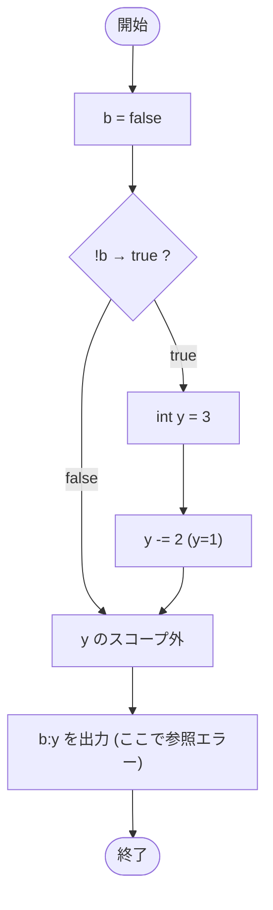

# Test0512 — フローチャートとトレース表

- 対象ファイル: `src/Test0512.java`
- パッケージ: デフォルト
- テーマ: ブロックスコープのコンパイルエラー。if ブロック内で宣言した `y` を外で使うと参照できない。

## ソースの要点

```java
boolean b = false;
if (!b) {
    int y = 3;
    y -= 2;
}
// y cannot be resolved to a variable
System.out.println(b + ":" + y);
```

## フローチャート（コンパイル成功した想定の論理フロー）



## トレース表（仮にコンパイルが通った場合）

| ステップ | 文 | b | y | 条件判定 | 出力 |
|---|---|---|---|---|---|
| 1 | `boolean b = false` | false | - | - | - |
| 2 | `if (!b)` | false | - | `!false` → true | - |
| 3 | `int y = 3` (ブロック内) | false | 3 | - | - |
| 4 | `y -= 2` | false | 1 | - | - |
| 5 | `}` ブロック終了 | false | y のスコープ終了 | - | - |
| 6 | `System.out.println(b + ":" + y)` | false | 参照不可 | - | コンパイルエラー |

## 実行結果（標準出力）

このコードはコンパイルエラーになる:

```
y cannot be resolved to a variable
```

## 学習ポイント

- このファイルは**コンパイルエラーを含む**学習用サンプル。
- if ブロック内で宣言した変数のスコープはブロック内のみ。
- ブロック外で `y` を使うには、if の外で `y` を宣言する必要がある。
