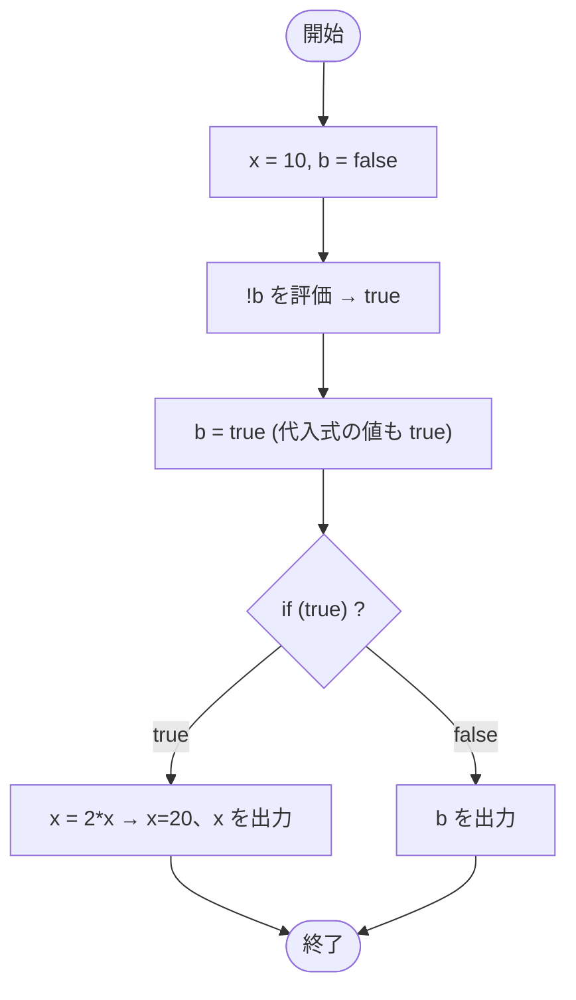

# Test0513 — フローチャートとトレース表

- 対象ファイル: `src/Test0513.java`
- パッケージ: デフォルト
- テーマ: 代入式が値を返すことを利用したトリッキーな if 文。`b = !b` の中で代入と評価を同時に行う。

## ソースの要点

```java
int x = 10;
boolean b = false;
if (b = !b) {
    System.out.print(x = 2 * x);
} else {
    System.out.print(b);
}
```

## フローチャート



## トレース表

| ステップ | 文 | x | b | 条件判定 | 出力 |
|---|---|---|---|---|---|
| 1 | `int x = 10` | 10 | - | - | - |
| 2 | `boolean b = false` | 10 | false | - | - |
| 3 | `if (b = !b)` | 10 | true | 代入式の値 true → if 成立 | - |
| 4 | `x = 2 * x` | 20 | true | - | - |
| 5 | `System.out.print(x)` | 20 | true | - | 20 |

## 実行結果（標準出力）

```
20
```

## 学習ポイント

- `b = !b` は代入式。値は代入後の `b`（true）を返す。
- `==`（比較）と `=`（代入）の取り違えに注意。boolean 型では `=` でも文法的に通ってしまう。
- `x = 2 * x` も代入式で、`println` の引数として代入後の値（20）が出力される。
