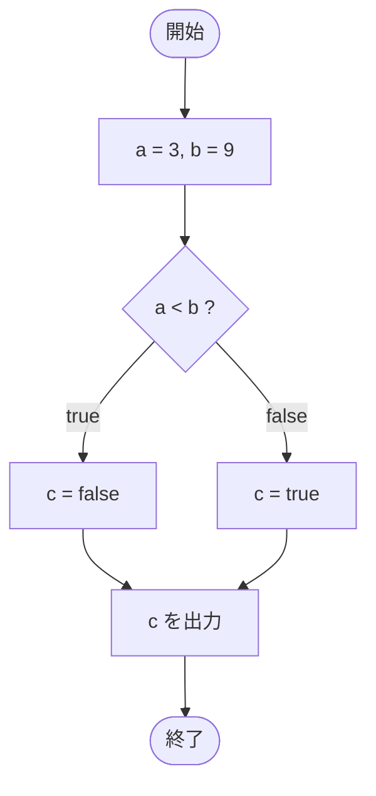

# Test0514 — フローチャートとトレース表

- 対象ファイル: `src/Test0514.java`
- パッケージ: デフォルト
- テーマ: 三項演算子で boolean を返すサンプル。

## ソースの要点

```java
int a = 3;
int b = 9;
boolean c = (a < b ? false : true);
System.out.println(c);
```

## フローチャート



## トレース表

| ステップ | 文 | a | b | c | 条件判定 | 出力 |
|---|---|---|---|---|---|---|
| 1 | `int a = 3` | 3 | - | - | - | - |
| 2 | `int b = 9` | 3 | 9 | - | - | - |
| 3 | `boolean c = (a < b ? false : true)` | 3 | 9 | false | `3 < 9` → true → false を選ぶ | - |
| 4 | `System.out.println(c)` | 3 | 9 | false | - | false |

## 実行結果（標準出力）

```
false
```

## 学習ポイント

- 三項演算子は boolean を返すことも可能。
- `a < b ? false : true` は意味的には `!(a < b)` と同じ。冗長な書き方の代表例。
- このような書き方を見たら、より簡潔な `!` で書き直せないか検討する。
