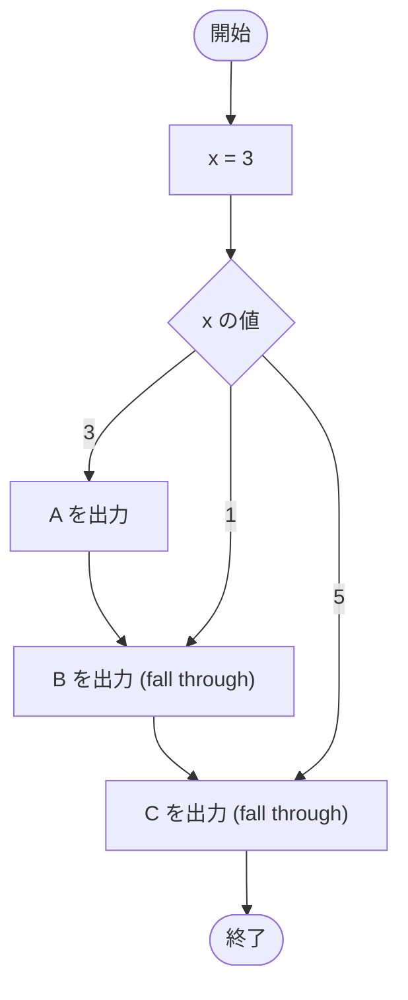

# Test0515 — フローチャートとトレース表

- 対象ファイル: `src/Test0515.java`
- パッケージ: デフォルト
- テーマ: switch 文の fall-through を学ぶ。`case 3` から `case 1` `case 5` へ次々と落ちていく。

## ソースの要点

```java
int x = 3;
switch (x) {
    case 3:
        System.out.print("A");
    case 1:
        System.out.print("B");
    case 5:
        System.out.print("C");
}
```

## フローチャート



## トレース表

| ステップ | 文 | x | マッチした case | 出力 |
|---|---|---|---|---|
| 1 | `int x = 3` | 3 | - | - |
| 2 | `switch (x)` | 3 | case 3 にジャンプ | - |
| 3 | `case 3: print("A")` | 3 | 3 | A |
| 4 | break なし → fall through | 3 | 1 | - |
| 5 | `case 1: print("B")` | 3 | 1 | B |
| 6 | break なし → fall through | 3 | 5 | - |
| 7 | `case 5: print("C")` | 3 | 5 | C |

## 実行結果（標準出力）

```
ABC
```

## 学習ポイント

- case ラベルの「数値順」と関係なく、マッチした case から順に下方向へ落ちていく。
- break がないと、後続の case が**すべて**実行される。
- ラベルの並び順が switch の実行順を決める。
