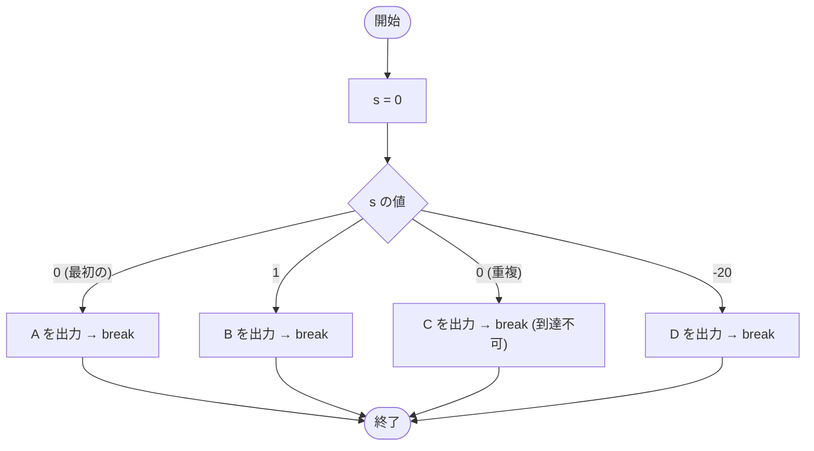

# Test0516 — フローチャートとトレース表

- 対象ファイル: `src/Test0516.java`
- パッケージ: デフォルト
- テーマ: switch の `case` ラベルは重複させられないことを確認するコンパイルエラーのサンプル。

## ソースの要点

```java
short s = 0;
switch (s) {
    case 0:
        System.out.print("A");
        break;
    case 1:
        System.out.print("B");
        break;
    case 0: // Duplicate case
        System.out.print("C");
        break;
    case -20:
        System.out.print("D");
        break;
}
```

## フローチャート（コンパイル成功した想定の論理フロー）



## トレース表（仮にコンパイルが通った場合の理屈）

| ステップ | 文 | s | マッチした case | 出力 |
|---|---|---|---|---|
| 1 | `short s = 0` | 0 | - | - |
| 2 | `switch (s)` | 0 | 最初の case 0 にジャンプ | - |
| 3 | `case 0: print("A")` | 0 | 0 | A |
| 4 | `break` | 0 | - | - |

## 実行結果（標準出力）

このコードはコンパイルエラーになる:

```
Duplicate case
```

## 学習ポイント

- このファイルは**コンパイルエラーを含む**学習用サンプル。
- switch 文で同じ値の `case` ラベルを 2 つ書くとコンパイルエラー。
- `short`/`byte`/`int`/`char`/`String`/`enum` が switch の式として使える。
