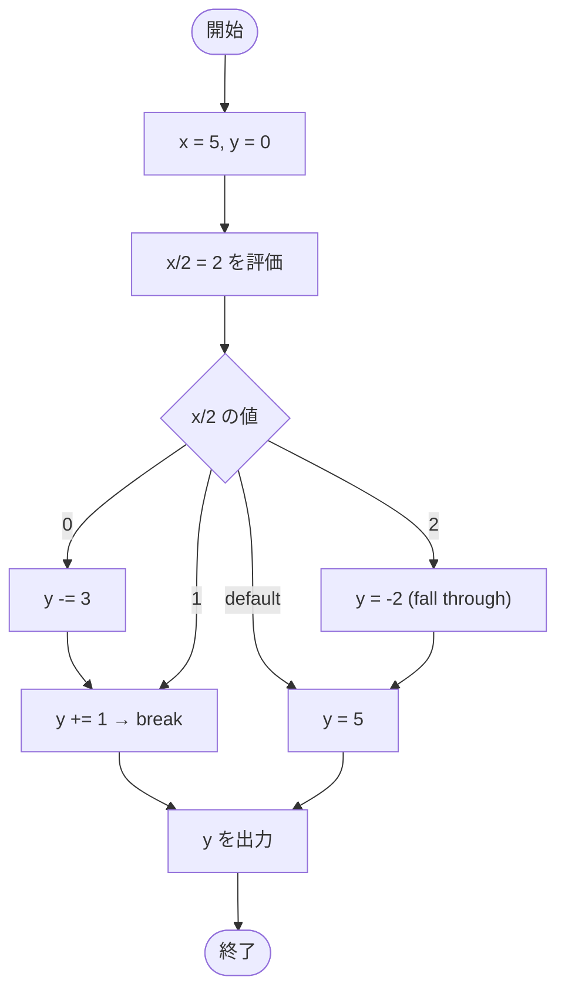

# Test0517 — フローチャートとトレース表

- 対象ファイル: `src/Test0517.java`
- パッケージ: デフォルト
- テーマ: switch の式に演算（`x / 2`）を使う書き方と、fall-through による値の累積変化を確認する。

## ソースの要点

```java
int x = 5;
int y = 0;
switch (x / 2) {
    case 0:
        y -= 3;
    case 1:
        y += 1;
        break;
    case 2:
        y = -2;
    default:
        y = 5;
}
System.out.print(y);
```

## フローチャート



## トレース表

| ステップ | 文 | x | y | x/2 | マッチした case | 出力 |
|---|---|---|---|---|---|---|
| 1 | `int x = 5` | 5 | - | - | - | - |
| 2 | `int y = 0` | 5 | 0 | - | - | - |
| 3 | `switch (x/2)` | 5 | 0 | 2 | case 2 にジャンプ | - |
| 4 | `case 2: y = -2` | 5 | -2 | 2 | 2 | - |
| 5 | break なし → fall through | 5 | -2 | 2 | default | - |
| 6 | `default: y = 5` | 5 | 5 | 2 | default | - |
| 7 | `System.out.print(y)` | 5 | 5 | - | - | 5 |

## 実行結果（標準出力）

```
5
```

## 学習ポイント

- switch の式には演算結果（`x / 2`）を使える。整数除算なので `5/2 = 2`。
- `case 2` には `break` がないので `default` まで fall-through する。
- 結果として最終的に `y = 5` が代入されて出力される。
