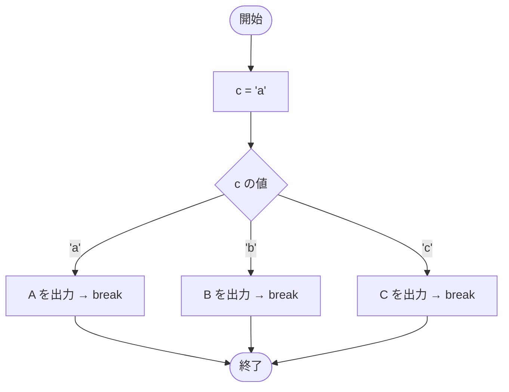

# Test0518 — フローチャートとトレース表

- 対象ファイル: `src/Test0518.java`
- パッケージ: デフォルト
- テーマ: `char` 型を switch の式に使うサンプル。

## ソースの要点

```java
char c = 'a';
switch (c) {
    case 'a':
        System.out.print("A");
        break;
    case 'b':
        System.out.print("B");
        break;
    case 'c':
        System.out.print("C");
        break;
}
```

## フローチャート



## トレース表

| ステップ | 文 | c | マッチした case | 出力 |
|---|---|---|---|---|
| 1 | `char c = 'a'` | 'a' | - | - |
| 2 | `switch (c)` | 'a' | case 'a' にジャンプ | - |
| 3 | `case 'a': print("A")` | 'a' | 'a' | A |
| 4 | `break` | 'a' | - | - |

## 実行結果（標準出力）

```
A
```

## 学習ポイント

- `char` 型は整数として扱われるため、switch の式に使える。
- `case` ラベルには文字リテラル `'a'` を直接書ける。
- `String` も Java SE 7 以降で switch に使える（→ `Test0520`）。
