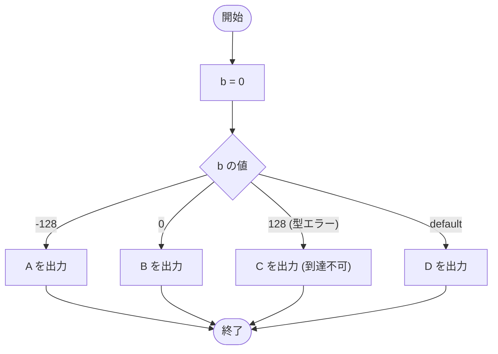

# Test0519 — フローチャートとトレース表

- 対象ファイル: `src/Test0519.java`
- パッケージ: デフォルト
- テーマ: `byte` 型の値域（-128〜127）を超える `case` ラベルはコンパイルエラーになる。

## ソースの要点

```java
byte b = 0;
switch (b) {
    case -128:
        System.out.print("A");
        break;
    case 0:
        System.out.print("B");
        break;
    case 128: // Type mismatch: cannot convert from int to byte
        System.out.print("C");
        break;
    default:
        System.out.print("D");
        break;
}
```

## フローチャート（コンパイル成功した想定の論理フロー）



## トレース表（`case 128` を除いた想定で）

| ステップ | 文 | b | マッチした case | 出力 |
|---|---|---|---|---|
| 1 | `byte b = 0` | 0 | - | - |
| 2 | `switch (b)` | 0 | case 0 にジャンプ | - |
| 3 | `case 0: print("B")` | 0 | 0 | B |
| 4 | `break` | 0 | - | - |

## 実行結果（標準出力）

このコードはコンパイルエラーになる:

```
Type mismatch: cannot convert from int to byte
```

## 学習ポイント

- このファイルは**コンパイルエラーを含む**学習用サンプル。
- `byte` の値域は -128〜127。128 はその範囲外なので case ラベルに使えない。
- switch の式の型と case ラベルの値が互換性を持つ必要がある。
