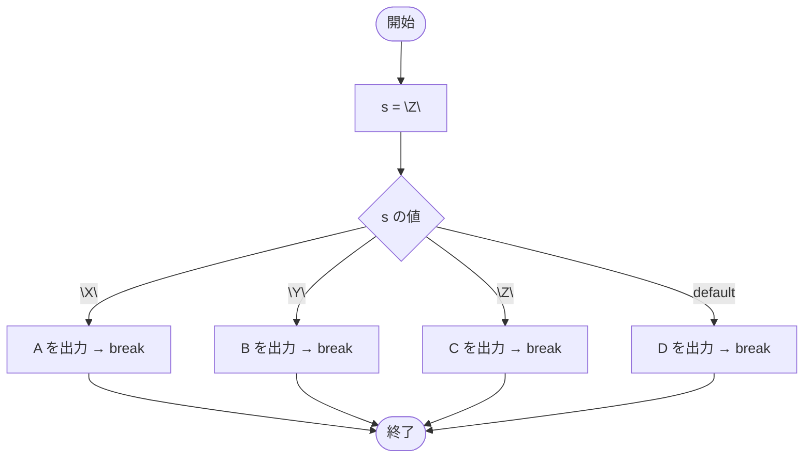

# Test0520 — フローチャートとトレース表

- 対象ファイル: `src/Test0520.java`
- パッケージ: デフォルト
- テーマ: `String` 型を switch の式に使うサンプル（Java SE 7 以降）。

## ソースの要点

```java
String s = "Z";
switch (s) {
    case "X":
        System.out.print("A");
        break;
    case "Y":
        System.out.print("B");
        break;
    case "Z":
        System.out.print("C");
        break;
    default:
        System.out.print("D");
        break;
}
```

## フローチャート



## トレース表

| ステップ | 文 | s | マッチした case | 出力 |
|---|---|---|---|---|
| 1 | `String s = "Z"` | "Z" | - | - |
| 2 | `switch (s)` | "Z" | case "Z" にジャンプ | - |
| 3 | `case "Z": print("C")` | "Z" | "Z" | C |
| 4 | `break` | "Z" | - | - |

## 実行結果（標準出力）

```
C
```

## 学習ポイント

- Java SE 7 以降、`String` を switch の式に使える。
- 文字列の比較は内部で `equals()` 相当で行われる（参照比較ではない）。
- null を渡すと `NullPointerException` になるので注意。
