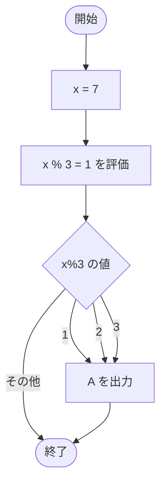

# Test0521 — フローチャートとトレース表

- 対象ファイル: `src/Test0521.java`
- パッケージ: デフォルト
- テーマ: 複数の `case` ラベルに同じ処理を割り当てる書き方（case ラベルを連続させる）。

## ソースの要点

```java
int x = 7;
switch (x % 3) {
    case 1:
    case 2:
    case 3:
        System.out.print("A");
}
```

## フローチャート



## トレース表

| ステップ | 文 | x | x%3 | マッチした case | 出力 |
|---|---|---|---|---|---|
| 1 | `int x = 7` | 7 | - | - | - |
| 2 | `switch (x % 3)` | 7 | 1 | case 1 にジャンプ | - |
| 3 | `case 1:` (空) → fall through | 7 | 1 | 1 | - |
| 4 | `case 2:` (空) → fall through | 7 | 1 | 2 | - |
| 5 | `case 3: print("A")` | 7 | 1 | 3 | A |

## 実行結果（標準出力）

```
A
```

## 学習ポイント

- 連続する `case` ラベル（中身が空）を並べると、複数の値で同じ処理を共有できる。
- `7 % 3 = 1` で case 1 にマッチし、case 3 の処理まで fall-through して `A` を出力。
- このパターンは「いずれかにマッチしたら同じ処理」を簡潔に書ける常用テクニック。
