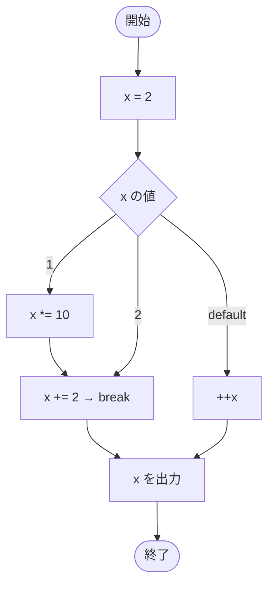

# Test0522 — フローチャートとトレース表

- 対象ファイル: `src/Test0522.java`
- パッケージ: デフォルト
- テーマ: `long` 型は switch の式に使えないことを確認するコンパイルエラーのサンプル。

## ソースの要点

```java
long x = 2;
// Cannot switch on a value of type long. Only convertible int values, strings
// or enum variables are permitted
switch (x) {
    case 1:
        x *= 10;
    case 2:
        x += 2;
        break;
    default:
        ++x;
}
System.out.println(x);
```

## フローチャート（仮に switch が `int` だった場合の論理フロー）



## トレース表（仮にコンパイルが通った場合）

| ステップ | 文 | x | マッチした case | 出力 |
|---|---|---|---|---|
| 1 | `long x = 2` | 2 | - | - |
| 2 | `switch (x)` | 2 | case 2 にジャンプ | - |
| 3 | `case 2: x += 2` | 4 | 2 | - |
| 4 | `break` | 4 | - | - |
| 5 | `System.out.println(x)` | 4 | - | 4 |

## 実行結果（標準出力）

このコードはコンパイルエラーになる:

```
Cannot switch on a value of type long. Only convertible int values, strings or enum variables are permitted
```

## 学習ポイント

- このファイルは**コンパイルエラーを含む**学習用サンプル。
- switch の式に使える型は `byte`/`short`/`int`/`char`（およびそのラッパー）、`String`、`enum` のみ。
- `long`、`float`、`double`、`boolean` は使えない。
