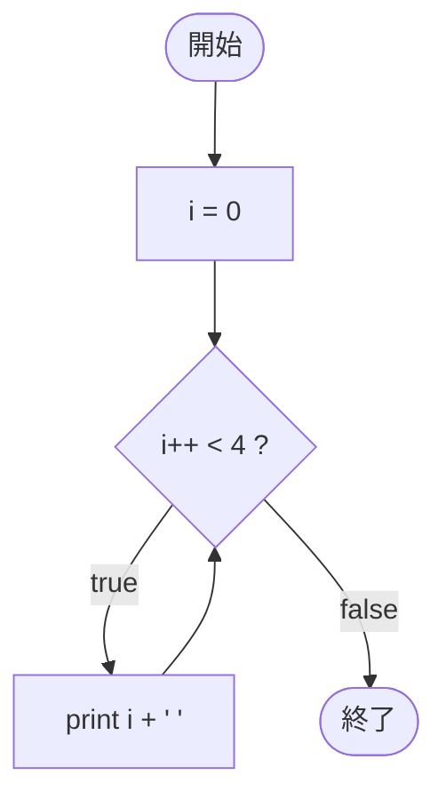

# Test0530 — フローチャートとトレース表

- 対象ファイル: `src/vol06_02/Test0530.java`
- パッケージ: `vol06_02`
- テーマ: while 文の条件式で後置インクリメント (`i++`) を使ったときの挙動確認。

## ソースの要点

```java
int i = 0;
while (i++ < 4) {
    System.out.print(i + " ");
}
```

- 条件 `i++ < 4` は「比較に使うのは増加前の値、その後に i を +1」する。
- ループ本体に入った時点で、i は既に判定時の値より 1 大きくなっている。

## フローチャート



## トレース表

| 周回 | 判定式 | 判定時 i | 判定後 i | 結果 | 出力 |
|----|----|----|----|----|----|
| 1 | `0 < 4` | 0 | 1 | true | `1 ` |
| 2 | `1 < 4` | 1 | 2 | true | `2 ` |
| 3 | `2 < 4` | 2 | 3 | true | `3 ` |
| 4 | `3 < 4` | 3 | 4 | true | `4 ` |
| 5 | `4 < 4` | 4 | 5 | false | （なし。ループ終了） |

## 実行結果（標準出力）

```
1 2 3 4 
```

## 学習ポイント

- 後置 `i++` は「現在の値で比較してから +1」する。
- 比較に使われた値ではなく、+1 された値がループ本体で参照される。
- 「ループから抜けた直後の i」は条件が偽になった値（ここでは 5）になる。
