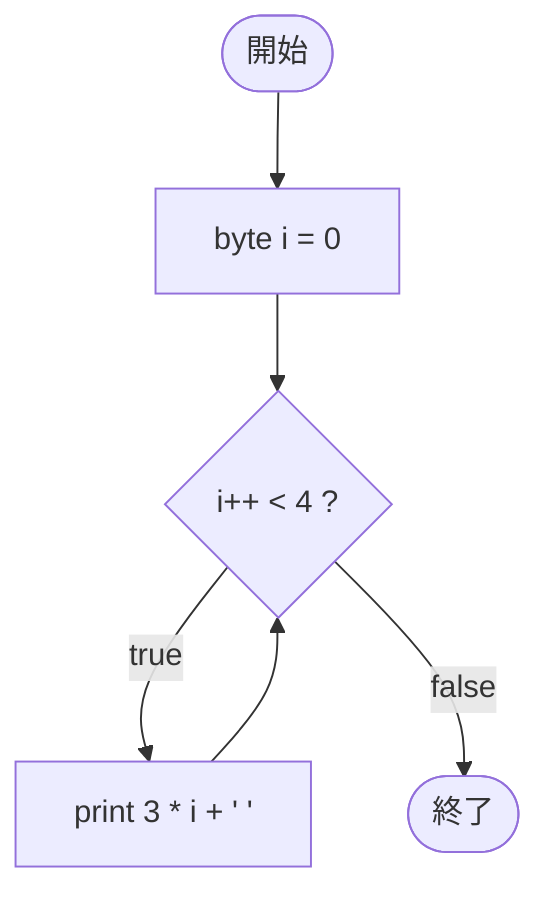

# Test0531 — フローチャートとトレース表

- 対象ファイル: `src/vol06_02/Test0531.java`
- パッケージ: `vol06_02`
- テーマ: byte 型のカウンタと、ループ本体で式 `3 * i` を出力するパターン。

## ソースの要点

```java
byte i = 0;
while (i++ < 4) {
    System.out.print(3 * i + " ");
}
```

- 条件 `i++ < 4` は判定後に i を +1。
- 本体に入ったときの i は判定時 +1 された値なので、`3 * i` は 3, 6, 9, 12 …となる。

## フローチャート



## トレース表

| 周回 | 判定式 | 判定時 i | 判定後 i | 結果 | 3 * i | 出力 |
|----|----|----|----|----|----|----|
| 1 | `0 < 4` | 0 | 1 | true | 3 | `3 ` |
| 2 | `1 < 4` | 1 | 2 | true | 6 | `6 ` |
| 3 | `2 < 4` | 2 | 3 | true | 9 | `9 ` |
| 4 | `3 < 4` | 3 | 4 | true | 12 | `12 ` |
| 5 | `4 < 4` | 4 | 5 | false | - | （ループ終了） |

## 実行結果（標準出力）

```
3 6 9 12 
```

## 学習ポイント

- `byte` 型でも、算術演算 `3 * i` は int に昇格して計算される。
- 後置インクリメントとループ本体の式評価のタイミングに注意。
