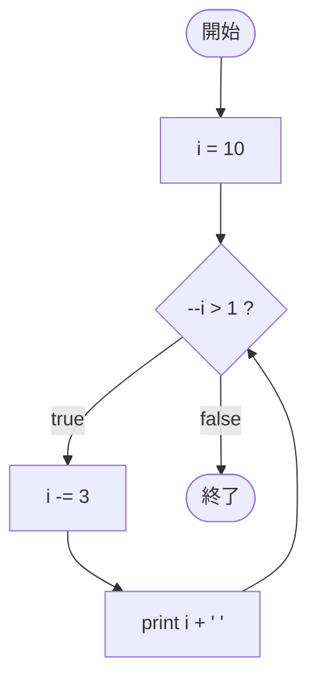

# Test0532 — フローチャートとトレース表

- 対象ファイル: `src/vol06_02/Test0532.java`
- パッケージ: `vol06_02`
- テーマ: 前置デクリメント `--i` を条件式に持ち、ループ本体でも `i -= 3` と i を変更する複合的なパターン。

## ソースの要点

```java
int i = 10;
while (--i > 1) {
    i -= 3;
    System.out.print(i + " ");
}
```

- 条件式 `--i > 1` は「i を先に -1 してから比較」。
- 本体でさらに `i -= 3`。1 周回ごとに i は実質 -4 進む。

## フローチャート



## トレース表

| 周回 | 判定前 i | `--i` 後 | 判定式 | 結果 | `i -= 3` 後 | 出力 |
|----|----|----|----|----|----|----|
| 1 | 10 | 9 | `9 > 1` | true | 6 | `6 ` |
| 2 | 6 | 5 | `5 > 1` | true | 2 | `2 ` |
| 3 | 2 | 1 | `1 > 1` | false | - | （ループ終了） |

## 実行結果（標準出力）

```
6 2 
```

## 学習ポイント

- 前置 `--i` は「先に -1 し、その値で比較」する。
- ループ本体内で条件変数を書き換えると、増減幅が見た目以上に大きくなる。
- ループ終了時の i は、条件が偽になった瞬間の値（ここでは 1）。
