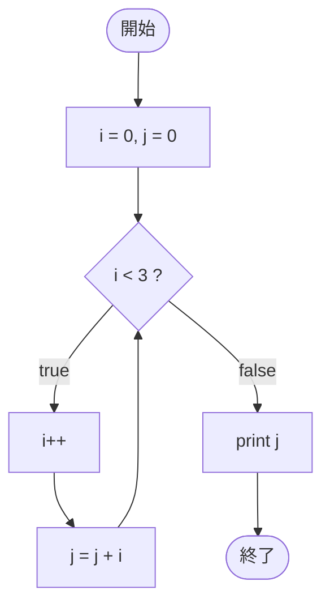

# Test0533 — フローチャートとトレース表

- 対象ファイル: `src/vol06_02/Test0533.java`
- パッケージ: `vol06_02`
- テーマ: while で 1〜3 の合計を求める累積加算 (1 + 2 + 3 = 6)。

## ソースの要点

```java
int i = 0, j = 0;
while (i < 3) {
    i++;
    j = j + i;
}
System.out.print(j);
```

- i をカウンタとして 1, 2, 3 と進めながら、j に加算する。
- ループ終了後に j（合計）を 1 回だけ表示する。

## フローチャート



## トレース表

| 周回 | 判定式 | 結果 | `i++` 後 i | `j = j + i` 後 j |
|----|----|----|----|----|
| 1 | `0 < 3` | true | 1 | 0 + 1 = 1 |
| 2 | `1 < 3` | true | 2 | 1 + 2 = 3 |
| 3 | `2 < 3` | true | 3 | 3 + 3 = 6 |
| 4 | `3 < 3` | false | - | - |

ループ終了後: `print(j)` → `6`

## 実行結果（標準出力）

```
6
```

## 学習ポイント

- 累積加算は「カウンタ i」と「合計 j」を分けて管理する典型パターン。
- 出力をループ内に置くか外に置くかで結果が大きく変わる。
