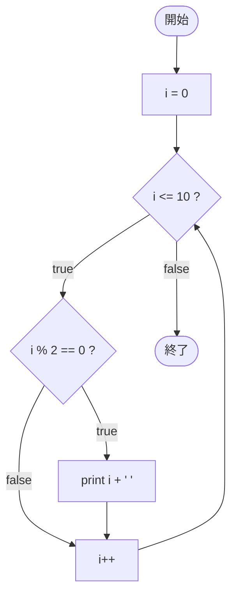

# Test0534 — フローチャートとトレース表

- 対象ファイル: `src/vol06_02/Test0534.java`
- パッケージ: `vol06_02`
- テーマ: while と if を組み合わせ、0〜10 の偶数だけを出力する。

## ソースの要点

```java
int i = 0;
while (i <= 10) {
    if (i % 2 == 0)
        System.out.print(i + " ");
    i++;
}
```

- 0 から 10 までのすべての値を順に判定し、偶数のときだけ出力する。

## フローチャート



## トレース表

| 周回 | i | `i <= 10` | `i % 2 == 0` | 出力 | i++ 後 |
|----|----|----|----|----|----|
| 1 | 0 | true | true | `0 ` | 1 |
| 2 | 1 | true | false | （なし） | 2 |
| 3 | 2 | true | true | `2 ` | 3 |
| 4 | 3 | true | false | （なし） | 4 |
| 5 | 4 | true | true | `4 ` | 5 |
| 6 | 5 | true | false | （なし） | 6 |
| 7 | 6 | true | true | `6 ` | 7 |
| 8 | 7 | true | false | （なし） | 8 |
| 9 | 8 | true | true | `8 ` | 9 |
| 10 | 9 | true | false | （なし） | 10 |
| 11 | 10 | true | true | `10 ` | 11 |
| 12 | 11 | false | - | - | - |

## 実行結果（標準出力）

```
0 2 4 6 8 10 
```

## 学習ポイント

- ループ内に if を組み合わせることで「条件を満たすものだけ処理する」典型パターンになる。
- `i % 2 == 0` は偶数判定。奇数は `i % 2 != 0` や `i % 2 == 1`。
- 0 も偶数として扱われる。
