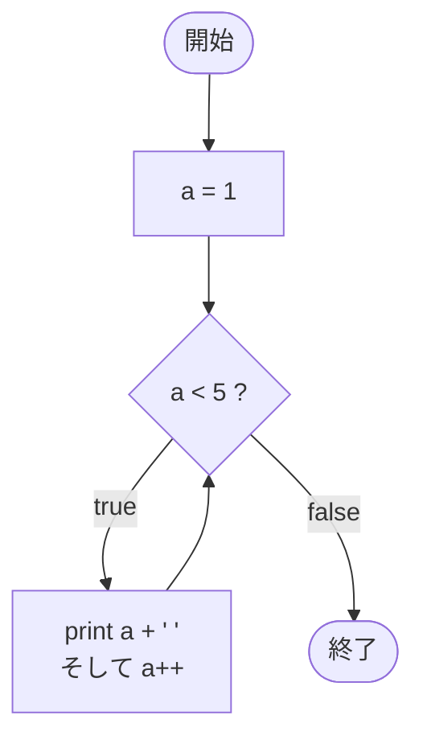

# Test0535 — フローチャートとトレース表

- 対象ファイル: `src/vol06_02/Test0535.java`
- パッケージ: `vol06_02`
- テーマ: ループ本体の式 `a++` で「現在の値を出力してから +1」。

## ソースの要点

```java
int a = 1;
while (a < 5) {
    System.out.print(a++ + " ");
}
```

- `a++` は「a の現在値を式の値として返してから a を +1」する後置インクリメント。
- 条件式の評価は本体に入る前に行うため、本体での `a++` は次の判定にだけ影響する。

## フローチャート



## トレース表

| 周回 | 判定式 | 判定時 a | 出力 (現在値) | a++ 後 |
|----|----|----|----|----|
| 1 | `1 < 5` true | 1 | `1 ` | 2 |
| 2 | `2 < 5` true | 2 | `2 ` | 3 |
| 3 | `3 < 5` true | 3 | `3 ` | 4 |
| 4 | `4 < 5` true | 4 | `4 ` | 5 |
| 5 | `5 < 5` false | 5 | - | - |

## 実行結果（標準出力）

```
1 2 3 4 
```

## 学習ポイント

- 後置 `a++` は「式の値は現在の a、そのあと a を +1」。
- Test0530 と違い、条件式に `a++` を入れていないので本体内での値はインクリメント前。
