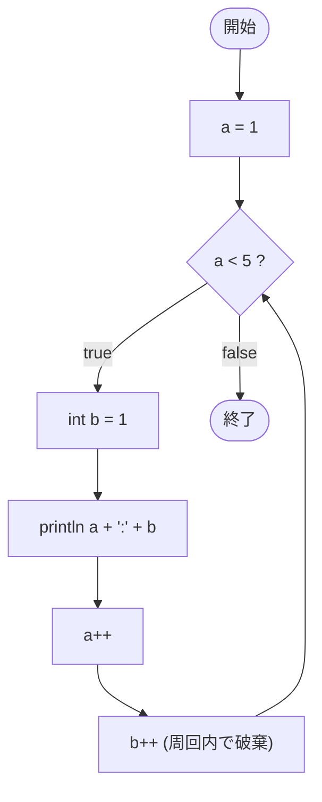

# Test0536 — フローチャートとトレース表

- 対象ファイル: `src/vol06_02/Test0536.java`
- パッケージ: `vol06_02`
- テーマ: ループ本体内で宣言した変数 `b` は毎回初期化される（ブロックスコープ）。

## ソースの要点

```java
int a = 1;
while (a < 5) {
    int b = 1;
    System.out.println(a + ":" + b);
    a++;
    b++;
}
```

- `b` は while ブロック内で宣言されるため、毎回 1 にリセットされる。
- 末尾の `b++` はそのループ周回内でだけ効くが、次の周回で `b = 1` に戻されるので結果に影響しない。

## フローチャート



## トレース表

| 周回 | 判定式 | 判定時 a | b 初期化 | 出力 | a++ 後 | b++ 後（破棄） |
|----|----|----|----|----|----|----|
| 1 | `1 < 5` true | 1 | 1 | `1:1` | 2 | 2 |
| 2 | `2 < 5` true | 2 | 1 | `2:1` | 3 | 2 |
| 3 | `3 < 5` true | 3 | 1 | `3:1` | 4 | 2 |
| 4 | `4 < 5` true | 4 | 1 | `4:1` | 5 | 2 |
| 5 | `5 < 5` false | 5 | - | - | - | - |

## 実行結果（標準出力）

```
1:1
2:1
3:1
4:1
```

## 学習ポイント

- ブロック内で宣言された変数のスコープはそのブロック内のみ。
- 毎回 `int b = 1;` が実行されるため、`b++` は次の周回に影響しない。
- 累積したいなら、ループの外側で宣言する必要がある。
