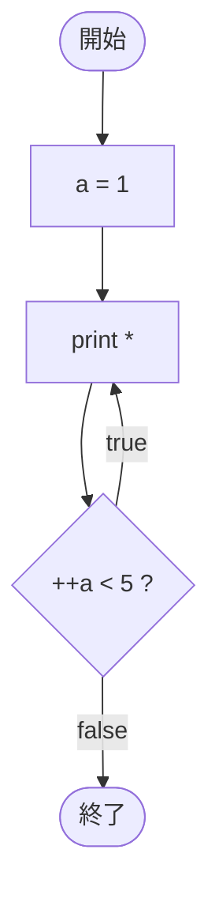

# Test0537 — フローチャートとトレース表

- 対象ファイル: `src/vol06_02/Test0537.java`
- パッケージ: `vol06_02`
- テーマ: do-while 文で `*` を出力。条件式に前置インクリメント `++a` を使う。

## ソースの要点

```java
int a = 1;
do {
    System.out.print("*");
} while (++a < 5);
```

- do-while は本体を必ず 1 回実行してから条件判定。
- `++a` は「先に +1 してから比較」する前置インクリメント。

## フローチャート



## トレース表

| 周回 | print 後 出力累積 | `++a` 後 a | 判定式 | 結果 |
|----|----|----|----|----|
| 1 | `*` | 2 | `2 < 5` | true |
| 2 | `**` | 3 | `3 < 5` | true |
| 3 | `***` | 4 | `4 < 5` | true |
| 4 | `****` | 5 | `5 < 5` | false |

## 実行結果（標準出力）

```
****
```

## 学習ポイント

- do-while は「最低 1 回は実行される」ことが while との大きな違い。
- `++a` は「+1 してから比較」、`a++` は「比較してから +1」。
- a=1 から始めて `++a < 5` が偽になるまで → 4 回出力。
