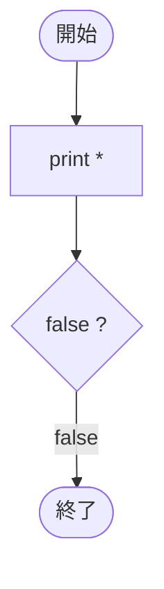

# Test0538 — フローチャートとトレース表

- 対象ファイル: `src/vol06_02/Test0538.java`
- パッケージ: `vol06_02`
- テーマ: do-while で条件式に `false` リテラル。最低 1 回は実行される性質の確認。

## ソースの要点

```java
do {
    System.out.print("*");
} while (false);
```

- 条件が常に偽でも、do-while は本体が 1 回必ず実行される。

## フローチャート



## トレース表

| 周回 | 本体実行 | 出力 | 判定式 | 結果 |
|----|----|----|----|----|
| 1 | print("*") | `*` | `false` | false（ループ終了） |

## 実行結果（標準出力）

```
*
```

## 学習ポイント

- do-while は「本体を実行 → 条件判定」の順なので、最初の 1 回は必ず実行される。
- これは while(false) との重要な違い。while(false) なら出力は何もない。
