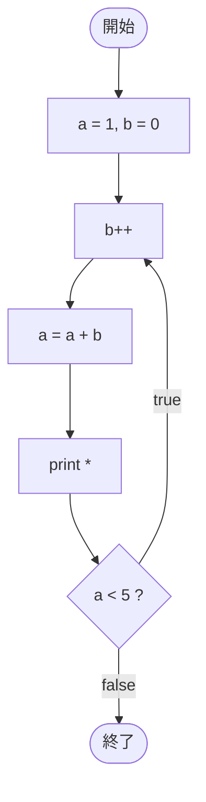

# Test0539 — フローチャートとトレース表

- 対象ファイル: `src/vol06_02/Test0539.java`
- パッケージ: `vol06_02`
- テーマ: do-while で 2 つの変数 a, b が連動して変化する累積処理。

## ソースの要点

```java
byte a = 1;
byte b = 0;
do {
    b++;
    a = a + b;
    System.out.print("*");
} while (a < 5);
```

- 各周回で b を +1 し、a に b を足し込む。
- a が 5 以上になったらループ終了。

## フローチャート



## トレース表

| 周回 | b++ 後 b | a = a + b 後 a | 出力 | 判定式 | 結果 |
|----|----|----|----|----|----|
| 1 | 1 | 1 + 1 = 2 | `*` | `2 < 5` | true |
| 2 | 2 | 2 + 2 = 4 | `**` | `4 < 5` | true |
| 3 | 3 | 4 + 3 = 7 | `***` | `7 < 5` | false |

## 実行結果（標準出力）

```
***
```

## 学習ポイント

- 2 変数を連動させると、増分が単純な等差ではなく階段状になる（+1, +2, +3 …）。
- do-while は条件判定が後ろなので、最後の 1 回は条件を満たさない値で実行される。
- byte 型でも加算結果は int に昇格するが、代入時に byte 範囲なら問題ない（ここでは a が `byte = byte + byte` の式で警告対象になり得るが、教材としてはこのまま扱う）。
