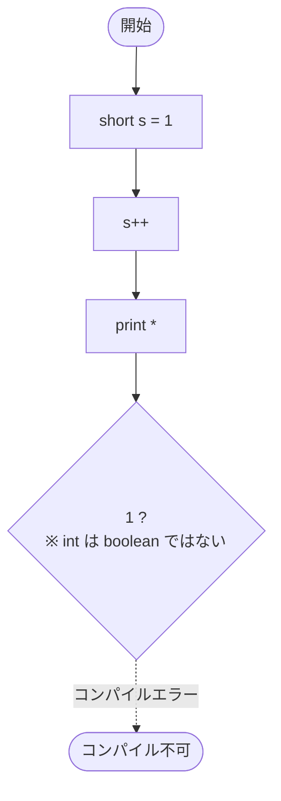

# Test0540 — フローチャートとトレース表

- 対象ファイル: `src/vol06_02/Test0540.java`
- パッケージ: `vol06_02`
- テーマ: do-while の条件式に `1` を渡すとコンパイルエラーになる例。

## ソースの要点

```java
short s = 1;
do {
    s++;
    System.out.print("*");
} while (1); // Type mismatch: cannot convert from int to boolean
```

- Java では、`if`・`while`・`do-while`・`for` の条件式は **必ず `boolean` 型** でなければならない。
- C / C++ のように 0 / 非 0 を真偽として扱うことはできない。
- このため `while (1)` は **コンパイルエラー** になる。

## フローチャート（論理上の構造）



## トレース表

| 段階 | 内容 |
|----|----|
| コンパイル | 失敗 |
| エラー内容 | `Type mismatch: cannot convert from int to boolean` |
| 実行 | 不可（クラスファイルが生成されない） |

## 実行結果（標準出力）

```
（実行不可。コンパイルエラー）
```

## 学習ポイント

- Java の条件式は **boolean 型限定**。`int` や `Object` を直接条件式に置けない。
- 無限ループを書きたい場合は `while (true)` と書く。
- 「コンパイルエラーを起こす書き方」をあえて学ぶことで、言語仕様の厳密さが理解できる。
