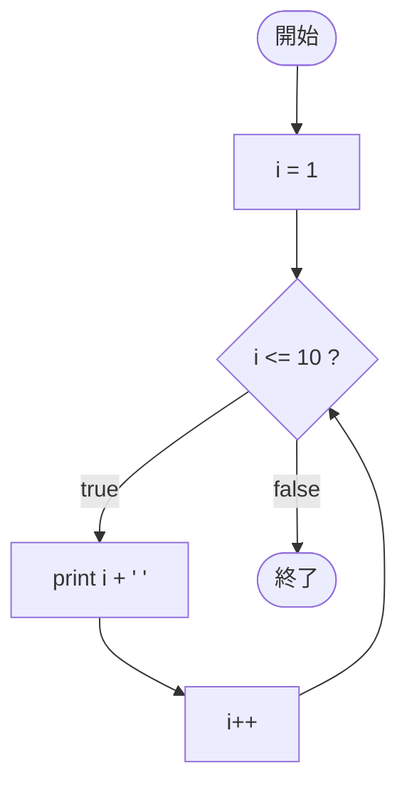

# Test0541 — フローチャートとトレース表

- 対象ファイル: `src/vol06_02/Test0541.java`
- パッケージ: `vol06_02`
- テーマ: for 文の基本パターン。1 から 10 まで順に出力する。

## ソースの要点

```java
for (int i = 1; i <= 10; i++) {
    System.out.print(i + " ");
}
```

- for 文の 3 要素: 初期化 `int i = 1`、条件 `i <= 10`、更新 `i++`。

## フローチャート



## トレース表

| 周回 | 判定式 | 結果 | 出力 | i++ 後 |
|----|----|----|----|----|
| 1 | `1 <= 10` | true | `1 ` | 2 |
| 2 | `2 <= 10` | true | `2 ` | 3 |
| 3 | `3 <= 10` | true | `3 ` | 4 |
| ... | ... | ... | ... | ... |
| 10 | `10 <= 10` | true | `10 ` | 11 |
| 11 | `11 <= 10` | false | - | - |

## 実行結果（標準出力）

```
1 2 3 4 5 6 7 8 9 10 
```

## 学習ポイント

- for 文の 3 要素は「初期化」「条件」「更新」の役割が明確で読みやすい。
- 「カウンタを 1 ずつ増やしながら N 回繰り返す」典型パターン。
- ループ変数 i のスコープは for 文内のみ。
