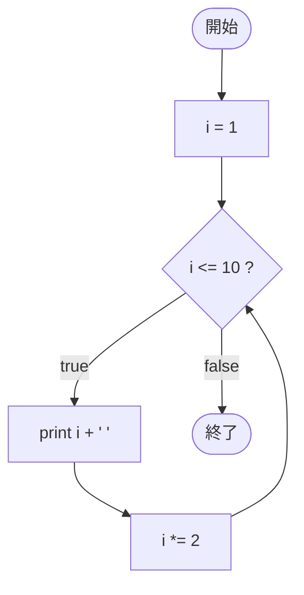

# Test0542 — フローチャートとトレース表

- 対象ファイル: `src/vol06_02/Test0542.java`
- パッケージ: `vol06_02`
- テーマ: 更新式に乗算 `i *= 2` を使った for 文。i は 1, 2, 4, 8 と倍々になる。

## ソースの要点

```java
for (int i = 1; i <= 10; i *= 2) {
    System.out.print(i + " ");
}
```

- 更新式は必ずしも `i++` でなくてよい。
- `i *= 2` で「i を 2 倍する」更新。

## フローチャート



## トレース表

| 周回 | 判定式 | 結果 | 出力 | `i *= 2` 後 |
|----|----|----|----|----|
| 1 | `1 <= 10` | true | `1 ` | 2 |
| 2 | `2 <= 10` | true | `2 ` | 4 |
| 3 | `4 <= 10` | true | `4 ` | 8 |
| 4 | `8 <= 10` | true | `8 ` | 16 |
| 5 | `16 <= 10` | false | - | - |

## 実行結果（標準出力）

```
1 2 4 8 
```

## 学習ポイント

- 更新式は任意の式が書けるので、等差だけでなく等比（倍々）も可能。
- 2 のべき乗を順に出すパターンで使われる。
