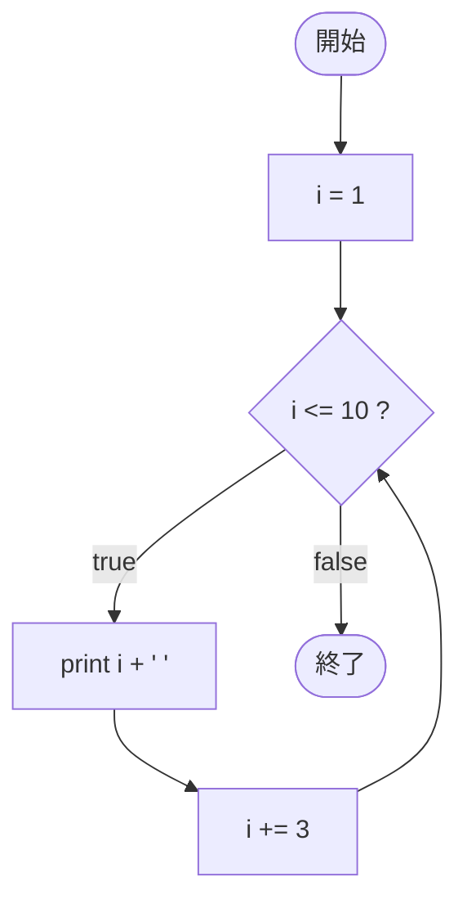

# Test0543 — フローチャートとトレース表

- 対象ファイル: `src/vol06_02/Test0543.java`
- パッケージ: `vol06_02`
- テーマ: 更新式に `i += 3` を使い、3 飛ばしで増加する for 文。

## ソースの要点

```java
for (int i = 1; i <= 10; i += 3) {
    System.out.print(i + " ");
}
```

- i は 1, 4, 7, 10, 13 ... と 3 ずつ増える。

## フローチャート



## トレース表

| 周回 | 判定式 | 結果 | 出力 | `i += 3` 後 |
|----|----|----|----|----|
| 1 | `1 <= 10` | true | `1 ` | 4 |
| 2 | `4 <= 10` | true | `4 ` | 7 |
| 3 | `7 <= 10` | true | `7 ` | 10 |
| 4 | `10 <= 10` | true | `10 ` | 13 |
| 5 | `13 <= 10` | false | - | - |

## 実行結果（標準出力）

```
1 4 7 10 
```

## 学習ポイント

- 等差の差分（公差）は更新式で調整できる。
- 終了条件が `<= 10` なので、10 はちょうど含まれる点に注意。
