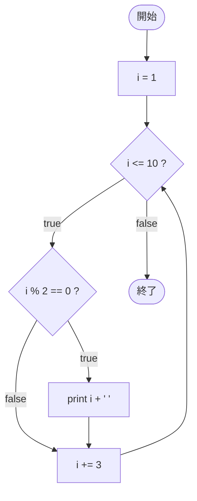

# Test0544 — フローチャートとトレース表

- 対象ファイル: `src/vol06_02/Test0544.java`
- パッケージ: `vol06_02`
- テーマ: for と if を組み合わせ、`i += 3` で進むカウンタの中で偶数だけを出力する。

## ソースの要点

```java
for (int i = 1; i <= 10; i += 3) {
    if (i % 2 == 0)
        System.out.print(i + " ");
}
```

- i は 1, 4, 7, 10 と進む。
- そのうち偶数 (i % 2 == 0) は 4, 10。

## フローチャート



## トレース表

| 周回 | i | `i <= 10` | `i % 2 == 0` | 出力 | `i += 3` 後 |
|----|----|----|----|----|----|
| 1 | 1 | true | false | （なし） | 4 |
| 2 | 4 | true | true | `4 ` | 7 |
| 3 | 7 | true | false | （なし） | 10 |
| 4 | 10 | true | true | `10 ` | 13 |
| 5 | 13 | false | - | - | - |

## 実行結果（標準出力）

```
4 10 
```

## 学習ポイント

- for と if を組み合わせると「特定の条件を満たす値だけ処理する」フィルタが書ける。
- 更新式 `i += 3` と 偶数判定 `i % 2 == 0` の組み合わせで、奇数→偶数→奇数→偶数と交互に来る。
