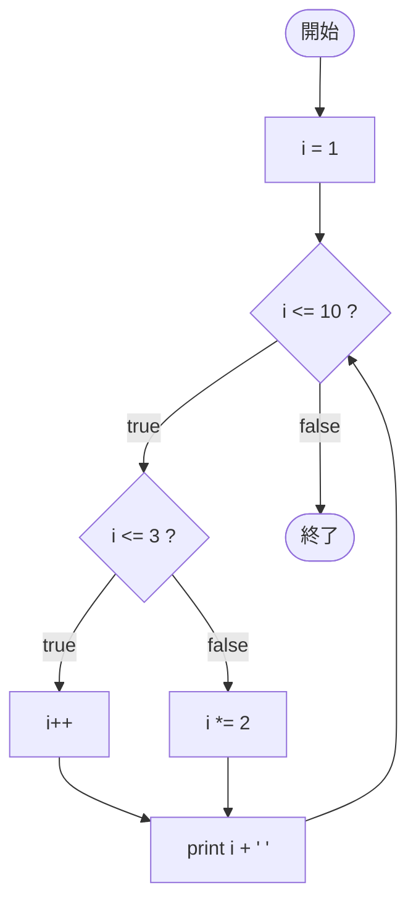

# Test0545 — フローチャートとトレース表

- 対象ファイル: `src/vol06_02/Test0545.java`
- パッケージ: `vol06_02`
- テーマ: 更新式を省略した for 文（`;` だけ）。ループ本体内で i を変化させる。

## ソースの要点

```java
for (int i = 1; i <= 10;) {
    if (i <= 3) {
        i++;
    } else {
        i *= 2;
    }
    System.out.print(i + " ");
}
```

- for 文の 3 番目の更新式は省略可能（セミコロンだけは残す）。
- 本体で i を変化させないと無限ループになるので、本体内の if-else で必ず i を更新している。

## フローチャート



## トレース表

| 周回 | 判定前 i | `i <= 10` | `i <= 3` | 更新後 i | 出力 |
|----|----|----|----|----|----|
| 1 | 1 | true | true (i++) | 2 | `2 ` |
| 2 | 2 | true | true (i++) | 3 | `3 ` |
| 3 | 3 | true | true (i++) | 4 | `4 ` |
| 4 | 4 | true | false (i *= 2) | 8 | `8 ` |
| 5 | 8 | true | false (i *= 2) | 16 | `16 ` |
| 6 | 16 | false | - | - | - |

## 実行結果（標準出力）

```
2 3 4 8 16 
```

## 学習ポイント

- for 文の各要素（初期化・条件・更新）はそれぞれ省略可能。
- 更新を省略した場合、本体内で必ずカウンタを変化させないと無限ループになる。
- 条件分岐で異なる更新ルール（+1 と *2）を切り替えるパターン。
