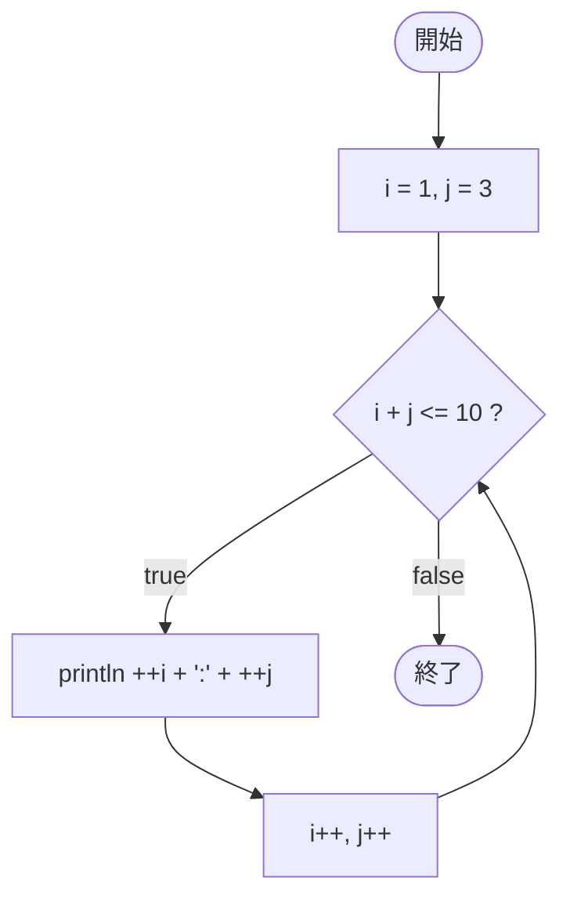

# Test0546 — フローチャートとトレース表

- 対象ファイル: `src/vol06_02/Test0546.java`
- パッケージ: `vol06_02`
- テーマ: for 文の初期化・更新部にカンマ演算子で複数の変数を扱う。さらに本体内で `++i`, `++j` も実行する。

## ソースの要点

```java
for (int i = 1, j = 3; i + j <= 10; i++, j++) {
    System.out.println(++i + ":" + ++j);
}
```

- 初期化部: `int i = 1, j = 3`（同じ型なら複数宣言可）。
- 条件式: `i + j <= 10`。
- 更新式: `i++, j++`（カンマで複数の式を順に評価）。
- 本体内でも `++i`, `++j` で 1 つずつ増やすため、1 周回で i, j がそれぞれ 2 ずつ増える。

## フローチャート



## トレース表

| 周回 | 判定前 i | 判定前 j | 判定式 | 結果 | ++i 後 | ++j 後 | 出力 | i++ 後 | j++ 後 |
|----|----|----|----|----|----|----|----|----|----|
| 1 | 1 | 3 | `1+3=4 <= 10` | true | 2 | 4 | `2:4` | 3 | 5 |
| 2 | 3 | 5 | `3+5=8 <= 10` | true | 4 | 6 | `4:6` | 5 | 7 |
| 3 | 5 | 7 | `5+7=12 <= 10` | false | - | - | - | - | - |

## 実行結果（標準出力）

```
2:4
4:6
```

## 学習ポイント

- for 文の初期化部・更新部はカンマ `,` で複数の式を並べられる（これは「カンマ演算子」と呼ばれる）。
- 同じ for 文の中で本体内も含めて変数を増やすと、1 周回あたりの増分が大きくなる（ここでは +2）。
- `++i` は前置インクリメントなので、`i` を +1 した値が文字列連結に使われる。
- `println` は最後に改行を出力するので、各周回が 1 行ずつ並ぶ。
