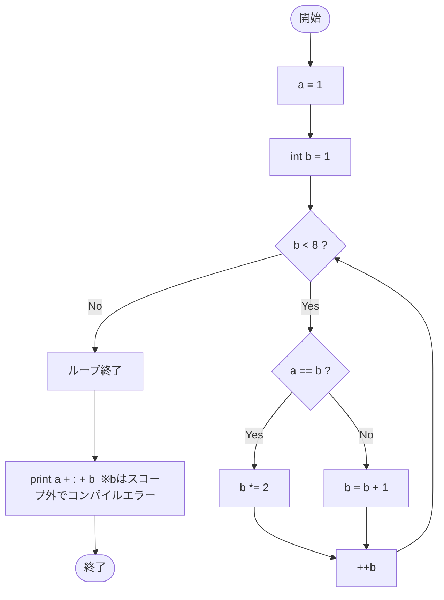

# Test0547 — フローチャートとトレース表

- 対象ファイル: `src/vol06_02/Test0547.java`
- パッケージ: `vol06_02`
- テーマ: for 文の初期化部で宣言した変数のスコープ（コンパイルエラー）。

## ソースの要点

```java
int a = 1;
for (int b = 1; b < 8; ++b) {
    if (a == b) {
        b *= 2;
    } else {
        b = b + 1;
    }
}
// b cannot be resolved to a variable
System.out.println(a + ":" + b);
```

## フローチャート



## トレース表

仮にコンパイルできたとした場合の for ループ内の変化を示す（実際はループ外の `b` 参照でコンパイルエラー）。

| ステップ | 文 | a | b | 評価/コメント |
|----|----|----|----|----|
| 1 | `int a = 1;` | 1 | - | - |
| 2 | `int b = 1;` | 1 | 1 | for初期化 |
| 3 | `b < 8` | 1 | 1 | true |
| 4 | `a == b` | 1 | 1 | true → `b *= 2` |
| 5 | `b *= 2` | 1 | 2 | - |
| 6 | `++b` | 1 | 3 | - |
| 7 | `b < 8` | 1 | 3 | true |
| 8 | `a == b` | 1 | 3 | false → `b = b + 1` |
| 9 | `b = b + 1` | 1 | 4 | - |
| 10 | `++b` | 1 | 5 | - |
| 11 | `b < 8` | 1 | 5 | true |
| 12 | `a == b` | 1 | 5 | false → `b = b + 1` |
| 13 | `b = b + 1` | 1 | 6 | - |
| 14 | `++b` | 1 | 7 | - |
| 15 | `b < 8` | 1 | 7 | true |
| 16 | `a == b` | 1 | 7 | false → `b = b + 1` |
| 17 | `b = b + 1` | 1 | 8 | - |
| 18 | `++b` | 1 | 9 | - |
| 19 | `b < 8` | 1 | 9 | false → ループ終了 |
| 20 | `println(a + ":" + b)` | - | - | コンパイルエラー: `b` はスコープ外 |

## 実行結果（標準出力）

```
（コンパイルエラーのため実行不可）
```

## 学習ポイント

- for 文の初期化部 (`int b = 1;`) で宣言した変数 `b` は、for ブロックの内側でのみ有効。
- ループ終了後に `b` を使うと「b cannot be resolved to a variable」というコンパイルエラーになる。
- ループ後にも値を参照したい場合は、for の外側で変数を宣言する。
