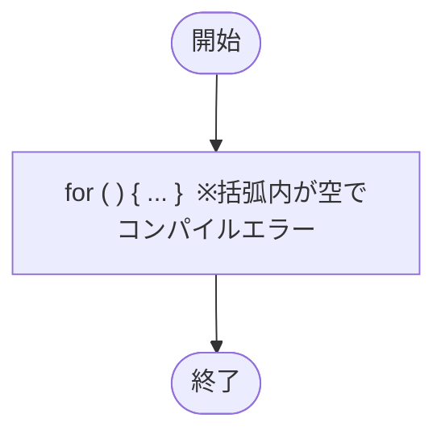

# Test0548 — フローチャートとトレース表

- 対象ファイル: `src/vol06_02/Test0548.java`
- パッケージ: `vol06_02`
- テーマ: for 文の括弧内が空（構文エラー）。

## ソースの要点

```java
// Syntax error, insert "; ; ) Statement" to complete BlockStatements
for() {
    System.out.println("A");
}
```

## フローチャート



## トレース表

| ステップ | 文 | 評価/コメント |
|----|----|----|
| 1 | `for() { ... }` | コンパイルエラー: 初期化部・条件部・更新部がすべて省略されていて構文上不正 |

## 実行結果（標準出力）

```
（コンパイルエラーのため実行不可）
```

## 学習ポイント

- for 文の括弧内は最低でも 2 つのセミコロン `for(;;)` が必要。
- `for(;;)` であれば無限ループとして合法だが、`for()` のように `;` も書かないと構文エラー。
- エラーメッセージ「insert "; ; ) Statement" to complete BlockStatements」は、足りない要素を補えという指摘。
