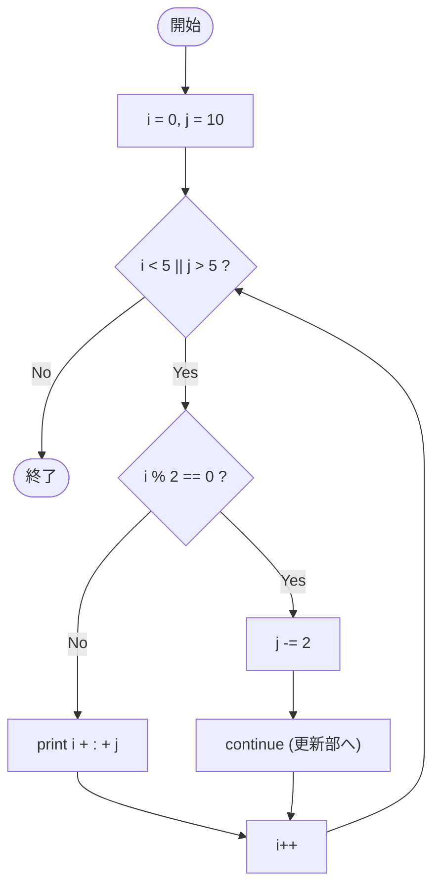

# Test0549 — フローチャートとトレース表

- 対象ファイル: `src/vol06_02/Test0549.java`
- パッケージ: `vol06_02`
- テーマ: for 文の初期化部・条件部に複数式、`continue` で更新部だけ実行。

## ソースの要点

```java
for (int i = 0, j = 10; i < 5 || j > 5; i++) {
    if (i % 2 == 0) {
        j -= 2;
        continue;
    }
    System.out.println(i + ":" + j);
}
```

## フローチャート



## トレース表

| ステップ | i | j | 条件 i<5 \|\| j>5 | i%2==0? | 動作 | 出力 |
|----|----|----|----|----|----|----|
| 1 | 0 | 10 | true | true | j=8, continue → i++ | - |
| 2 | 1 | 8 | true | false | print, i++ | `1:8` |
| 3 | 2 | 8 | true | true | j=6, continue → i++ | - |
| 4 | 3 | 6 | true | false | print, i++ | `3:6` |
| 5 | 4 | 6 | true | true | j=4, continue → i++ | - |
| 6 | 5 | 4 | 5<5=false, 4>5=false → false | - | ループ終了 | - |

## 実行結果（標準出力）

```
1:8
3:6
```

## 学習ポイント

- for の初期化部・更新部はカンマ区切りで複数式を書ける（`int i = 0, j = 10`）。
- `continue` は for の場合「更新部 → 条件判定」へ飛ぶ。`i++` は実行される。
- 条件式に `||` を使うと短絡評価。`i < 5` が false でも `j > 5` を評価する。
