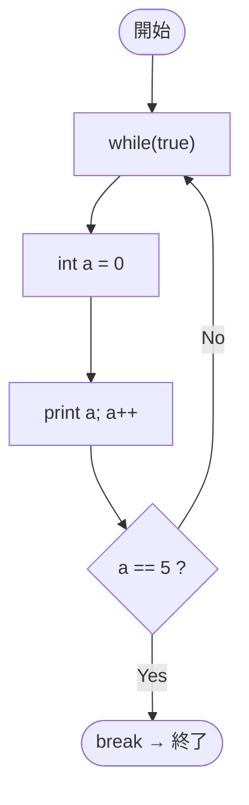

# Test0550 — フローチャートとトレース表

- 対象ファイル: `src/vol06_02/Test0550.java`
- パッケージ: `vol06_02`
- テーマ: ループ内で毎回変数を初期化すると無限ループになる例。

## ソースの要点

```java
while (true) {
    int a = 0;
    System.out.println(a++);
    if (a == 5)
        break;
}
```

## フローチャート



## トレース表

| 反復 | a 宣言直後 | print 値 | a++後 | a==5? | コメント |
|----|----|----|----|----|----|
| 1 | 0 | 0 | 1 | false | 続行 |
| 2 | 0 | 0 | 1 | false | 続行 |
| 3 | 0 | 0 | 1 | false | 続行 |
| ... | 0 | 0 | 1 | false | 無限に同じ動作 |

## 実行結果（標準出力）

```
0
0
0
0
...（無限ループ）
```

## 学習ポイント

- `int a = 0;` がループ本体内にあるので、毎回 `a` は 0 に再初期化される。
- 結果として `a++` 後の `a` はいつも 1。`a == 5` は永遠に成立しないので `break` には到達しない。
- ループ変数はループの外で宣言するのが鉄則。
