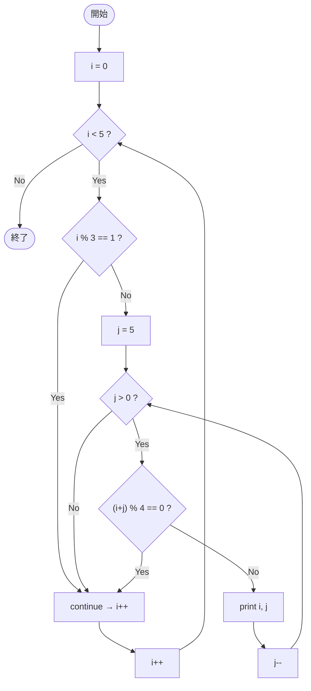

# Test0551 — フローチャートとトレース表

- 対象ファイル: `src/vol06_02/Test0551.java`
- パッケージ: `vol06_02`
- テーマ: 二重 for ループでの `continue`（外側）と `break`（内側）。

## ソースの要点

```java
for (int i = 0; i < 5; i++) {
    if (i % 3 == 1)
        continue;
    for (int j = 5; j > 0; j--) {
        if ((i + j) % 4 == 0)
            break;
        System.out.println("i=" + i + " j=" + j);
    }
}
```

## フローチャート



## トレース表

| 外 i | i%3==1? | 内 j | (i+j)%4 | 動作 | 出力 |
|----|----|----|----|----|----|
| 0 | no | 5 | 1 | print | `i=0 j=5` |
| 0 | - | 4 | 0 | break 内側 | - |
| 1 | yes | - | - | continue 外側 | - |
| 2 | no | 5 | 3 | print | `i=2 j=5` |
| 2 | - | 4 | 2 | print | `i=2 j=4` |
| 2 | - | 3 | 1 | print | `i=2 j=3` |
| 2 | - | 2 | 0 | break 内側 | - |
| 3 | no | 5 | 0 | break 内側（即時） | - |
| 4 | yes | - | - | continue 外側 | - |

## 実行結果（標準出力）

```
i=0 j=5
i=2 j=5
i=2 j=4
i=2 j=3
```

## 学習ポイント

- ラベルなしの `break` / `continue` は最も内側のループにのみ作用する。
- 外側で `continue` を使うと、内側ループはそもそも実行されない（i=1, i=4 の場合）。
- 内側ループ条件不成立だけでなく、`break` でも内側ループから抜ける。
