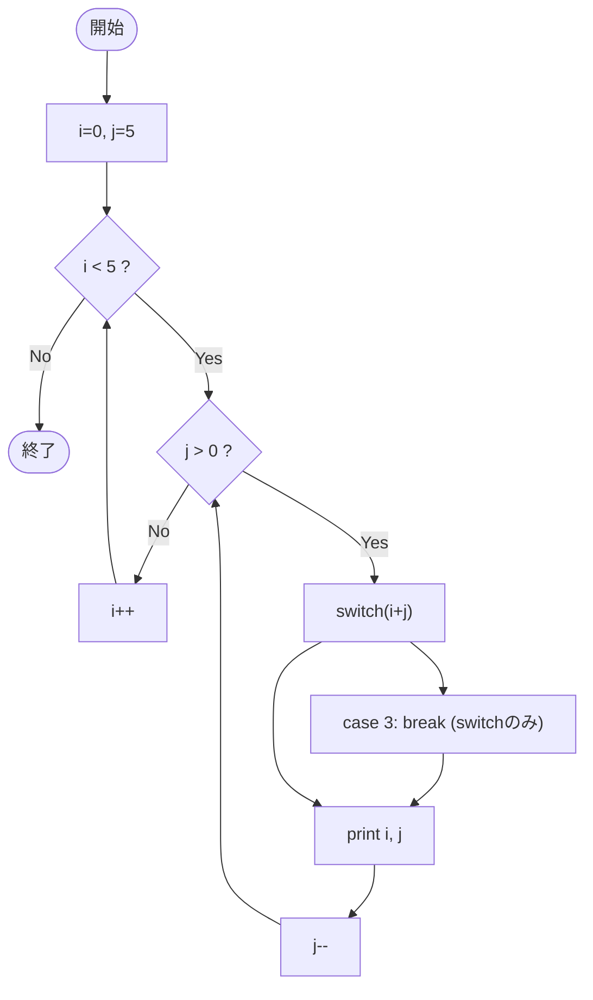

# Test0552 — フローチャートとトレース表

- 対象ファイル: `src/vol06_02/Test0552.java`
- パッケージ: `vol06_02`
- テーマ: 外側スコープで宣言した変数を使う二重 for + switch、内側ループ変数の再利用。

## ソースの要点

```java
int i = 0, j = 5;
for (; i < 5; i++) {
    for (; j > 0; j--) {
        switch (i + j) {
            case 3:
                break; // switch を抜けるだけ
        }
        System.out.println("i=" + i + " j=" + j);
    }
}
```

## フローチャート



## トレース表

| 外 i | 内 j | i+j | switch動作 | 出力 | 次の j |
|----|----|----|----|----|----|
| 0 | 5 | 5 | 一致なし | `i=0 j=5` | 4 |
| 0 | 4 | 4 | 一致なし | `i=0 j=4` | 3 |
| 0 | 3 | 3 | case 3 → break(switch) | `i=0 j=3` | 2 |
| 0 | 2 | 2 | 一致なし | `i=0 j=2` | 1 |
| 0 | 1 | 1 | 一致なし | `i=0 j=1` | 0 → 内側終了 |
| 1〜4 | 0 | - | 内側 j>0 不成立で入らない | - | - |

## 実行結果（標準出力）

```
i=0 j=5
i=0 j=4
i=0 j=3
i=0 j=2
i=0 j=1
```

## 学習ポイント

- for の初期化部を空にし、外で宣言した変数を流用できる（`for (; i < 5; i++)`）。
- 内側ループ変数 `j` も外側スコープなので、内側を抜けた後はリセットされない。一度 0 になると、以降の外側反復では内側に入らない。
- `switch` 内の `break` は switch を抜けるだけで、ループには影響しない。
