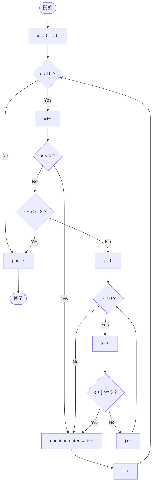

# Test0553 — フローチャートとトレース表

- 対象ファイル: `src/vol06_02/Test0553.java`
- パッケージ: `vol06_02`
- テーマ: ラベル付き `continue` / `break` による多重ループ制御。

## ソースの要点

```java
int x = 0;
outer: for (int i = 0; i < 10; i++) {
    x++;
    if (x < 3) continue outer;
    if (x + i >= 8) break outer;

    inner: for (int j = 0; j < 10; j++) {
        x++;
        if (x + j >= 5) break inner;
    }
}
System.out.println(x);
```

## フローチャート



## トレース表

| 外 i | 直後 x | x<3? | x+i>=8? | 内 j | x（内側で増加） | x+j>=5? | 動作 |
|----|----|----|----|----|----|----|----|
| 0 | 1 | yes | - | - | - | - | continue outer |
| 1 | 2 | yes | - | - | - | - | continue outer |
| 2 | 3 | no | 3+2=5, no | 0 | 4 | 4+0=4, no | j++ |
| 2 | - | - | - | 1 | 5 | 5+1=6, yes | break inner |
| 3 | 6 | no | 6+3=9, yes | - | - | - | break outer |

最終 x = 6。

## 実行結果（標準出力）

```
6
```

## 学習ポイント

- `continue outer` は外側ループの更新部（`i++`）に飛ぶ。内側ループは入らない（i=0,1 の時）。
- `break outer` は外側ループごと脱出する。
- ラベル付き制御は多重ループの可読性を上げるが、乱用すると追いにくい。
