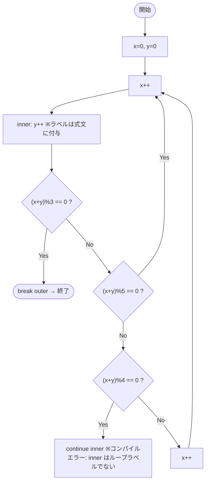

# Test0554 — フローチャートとトレース表

- 対象ファイル: `src/vol06_02/Test0554.java`
- パッケージ: `vol06_02`
- テーマ: ラベルはループにしか使えない（`continue inner` がコンパイルエラー）。

## ソースの要点

```java
int x = 0, y = 0;
outer: for (;;) {
    x++;
    inner: y++;          // ラベルは式文に付いているだけ
    if ((x + y) % 3 == 0) break outer;
    if ((x + y) % 5 == 0) continue outer;
    if ((x + y) % 4 == 0) continue inner; // The label inner is missing
    x++;
}
```

## フローチャート



## トレース表

`continue inner` がエラーになるためコンパイル不可。仮にその行を無視して論理だけ追うと:

| 反復 | x++後 | y++後 | x+y | %3==0? | %5==0? | %4==0? | 動作 |
|----|----|----|----|----|----|----|----|
| 1 | 1 | 1 | 2 | no | no | no | x++ → x=2 |
| 2 | 3 | 2 | 5 | no | yes | - | continue outer |
| 3 | 4 | 3 | 7 | no | no | no | x++ → x=5 |
| 4 | 6 | 4 | 10 | no | yes | - | continue outer |
| 5 | 7 | 5 | 12 | yes | - | - | break outer |

## 実行結果（標準出力）

```
（コンパイルエラーのため実行不可）
```

## 学習ポイント

- Java の `continue`/`break` のラベルは **ループ文** (`for`, `while`, `do-while`) にしか機能しない。
- `inner: y++;` のように単独の文にラベルを付けても、そのラベルへ `continue` はできない（「The label inner is missing」というエラー）。
- ラベルは「ループ全体に対する目印」と覚える。
