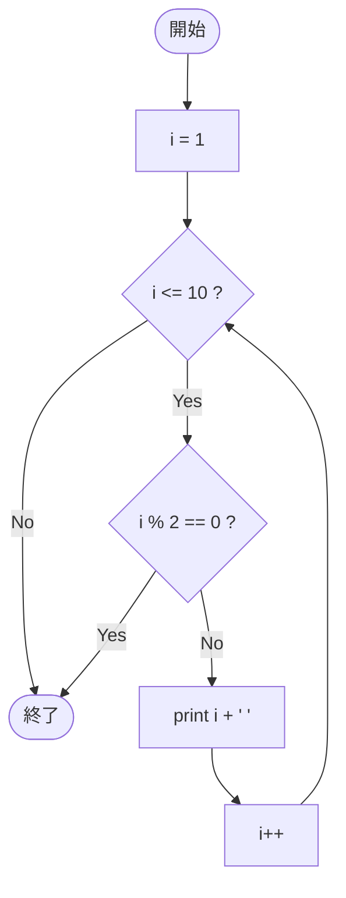

# Test0555 — フローチャートとトレース表

- 対象ファイル: `src/vol06_02/Test0555.java`
- パッケージ: `vol06_02`
- テーマ: `break` でループを抜ける単純な for 文。

## ソースの要点

```java
for (int i = 1; i <= 10; i++) {
    if (i % 2 == 0) {
        break;
    }
    System.out.print(i + " ");
}
```

## フローチャート



## トレース表

| 反復 | i | i<=10? | i%2==0? | 動作 | 出力 |
|----|----|----|----|----|----|
| 1 | 1 | true | false | print | `1 ` |
| 2 | 2 | true | true | break | - |

## 実行結果（標準出力）

```
1 
```

## 学習ポイント

- `i=2` で `i % 2 == 0` が真になり、`break` で即座にループを抜ける。
- `System.out.print` は改行しないので、出力は `1 ` の 1 行のみ。
- 最初の偶数で止めたい場合の典型パターン。
