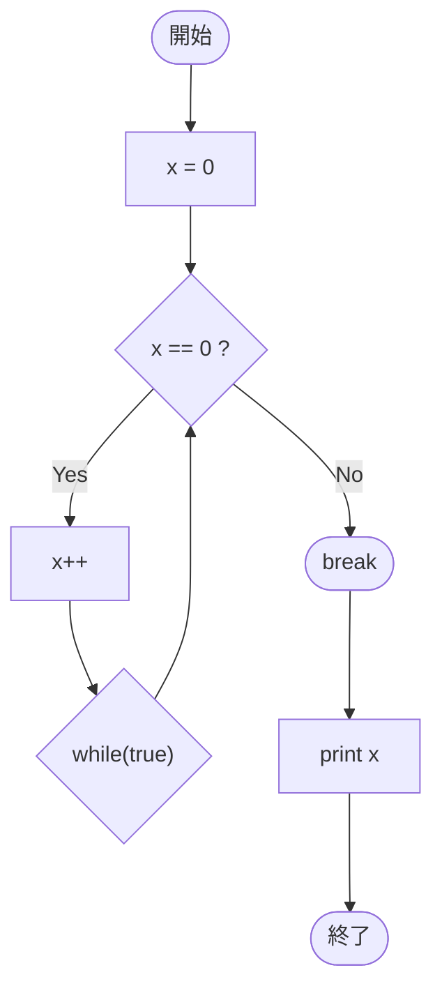

# Test0556 — フローチャートとトレース表

- 対象ファイル: `src/vol06_02/Test0556.java`
- パッケージ: `vol06_02`
- テーマ: `do-while(true)` 内の `break` での脱出。

## ソースの要点

```java
int x = 0;
do {
    if (x == 0) {
        x++;
    } else {
        break;
    }
} while (true);
System.out.println(x);
```

## フローチャート



## トレース表

| 反復 | 開始 x | x==0? | 動作 | 終了 x |
|----|----|----|----|----|
| 1 | 0 | yes | x++ | 1 |
| 2 | 1 | no | break | 1 |

最後に `println(x)` → 出力 `1`。

## 実行結果（標準出力）

```
1
```

## 学習ポイント

- `do-while` は条件にかかわらず本体を 1 回は実行する。
- `while(true)` は無限ループだが、本体内の `break` で抜けられる。
- 出口を `break` に頼る場合は、必ず到達する条件があるか確認する。
