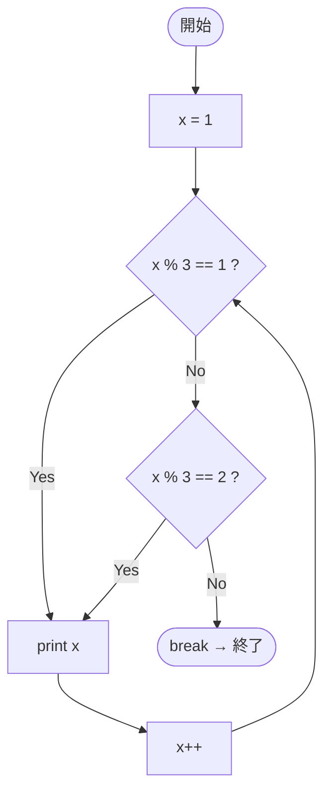

# Test0557 — フローチャートとトレース表

- 対象ファイル: `src/vol06_02/Test0557.java`
- パッケージ: `vol06_02`
- テーマ: 条件部を省略した for 文（無限ループ）と `break`。

## ソースの要点

```java
for (int x = 1;; x++) {
    if (x % 3 == 1) {
        System.out.print(x + " ");
    } else if (x % 3 == 2) {
        System.out.print(x + " ");
    } else {
        break;
    }
}
```

## フローチャート



## トレース表

| 反復 | x | x%3 | 分岐 | 出力 |
|----|----|----|----|----|
| 1 | 1 | 1 | print | `1 ` |
| 2 | 2 | 2 | print | `2 ` |
| 3 | 3 | 0 | else → break | - |

## 実行結果（標準出力）

```
1 2 
```

## 学習ポイント

- for 文の条件部を省略すると無条件 true。終了は `break` で行う。
- `x % 3` が 0 になる最初の値（x=3）で break。
- if-else if-else の連鎖は、最後の else で「上記以外」を確実に拾える。
