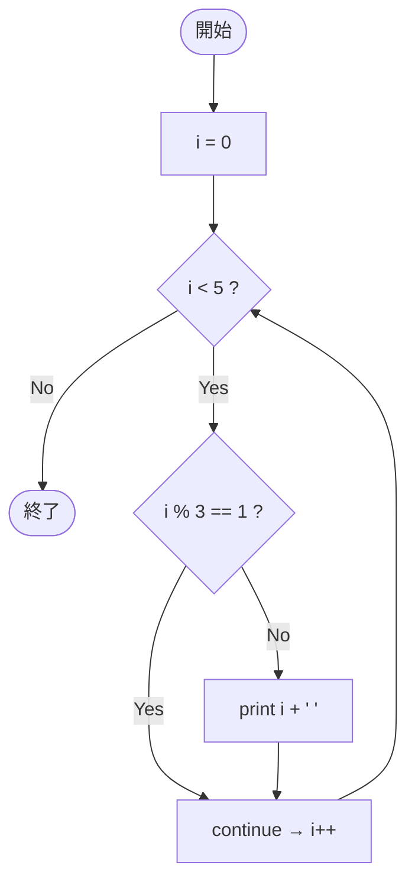

# Test0558 — フローチャートとトレース表

- 対象ファイル: `src/vol06_02/Test0558.java`
- パッケージ: `vol06_02`
- テーマ: for 文での `continue`（次の反復へスキップ）。

## ソースの要点

```java
for (int i = 0; i < 5; i++) {
    if (i % 3 == 1)
        continue;
    System.out.print(i + " ");
}
```

## フローチャート



## トレース表

| 反復 | i | i<5? | i%3==1? | 動作 | 出力 |
|----|----|----|----|----|----|
| 1 | 0 | true | false | print | `0 ` |
| 2 | 1 | true | true | continue | - |
| 3 | 2 | true | false | print | `2 ` |
| 4 | 3 | true | false | print | `3 ` |
| 5 | 4 | true | true | continue | - |
| 6 | 5 | false | - | 終了 | - |

## 実行結果（標準出力）

```
0 2 3 
```

## 学習ポイント

- `continue` は当該反復だけスキップし、更新部（`i++`）→ 条件判定に飛ぶ。
- `i % 3 == 1` を満たす i=1, 4 がスキップされる。
- 残った 0, 2, 3 のみ出力される。
