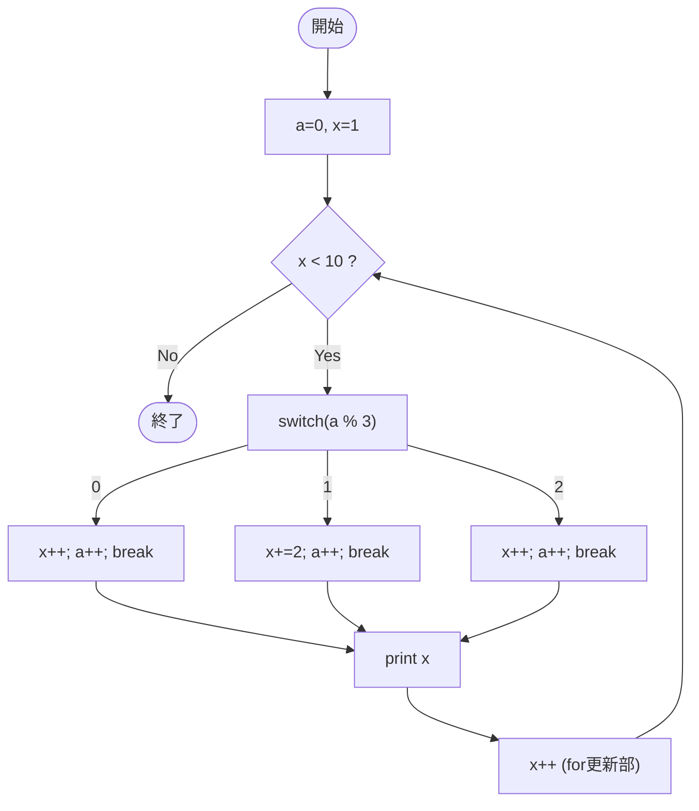

# Test0559 — フローチャートとトレース表

- 対象ファイル: `src/vol06_02/Test0559.java`
- パッケージ: `vol06_02`
- テーマ: for 文の更新部と switch 内でループ変数を二重に変化させる例。

## ソースの要点

```java
int a = 0;
for (int x = 1; x < 10; x++) {
    switch (a % 3) {
        case 0: x++; a++; break;
        case 1: x += 2; a = a + 1; break;
        case 2: x++; ++a; break;
    }
    System.out.print(x + " ");
}
```

## フローチャート



## トレース表

| 反復 | 開始 a | a%3 | 開始 x | switch後 x | switch後 a | print | 更新後 x |
|----|----|----|----|----|----|----|----|
| 1 | 0 | 0 | 1 | 2 | 1 | `2 ` | 3 |
| 2 | 1 | 1 | 3 | 5 | 2 | `5 ` | 6 |
| 3 | 2 | 2 | 6 | 7 | 3 | `7 ` | 8 |
| 4 | 3 | 0 | 8 | 9 | 4 | `9 ` | 10 |
| 5 | 4 | - | 10 | - | - | x<10 false → 終了 | - |

## 実行結果（標準出力）

```
2 5 7 9 
```

## 学習ポイント

- ループ変数 `x` を本体内でも変化させると、ループ進行が複雑になる。
- 1 反復あたり `x` は switch 内の増分と for 更新部 `x++` の両方で増える。
- `a` は毎回 1 ずつ増えるので `a % 3` は 0 → 1 → 2 → 0 と循環する。
