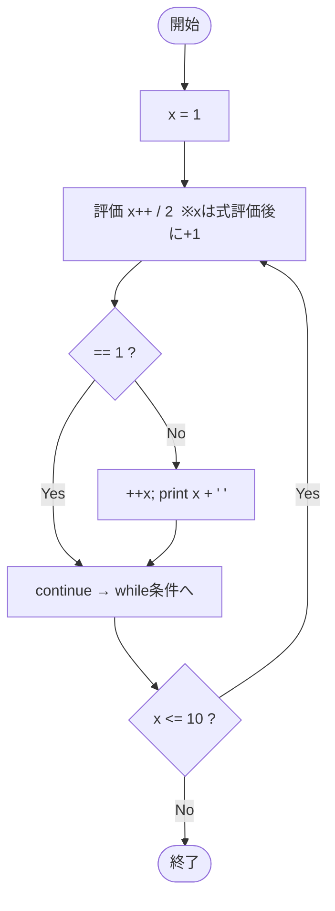

# Test0560 — フローチャートとトレース表

- 対象ファイル: `src/vol06_02/Test0560.java`
- パッケージ: `vol06_02`
- テーマ: `do-while` 内での後置インクリメント／前置インクリメントの評価順と `continue`。

## ソースの要点

```java
int x = 1;
do {
    if (x++ / 2 == 1) {
        continue;
    }
    System.out.print(++x + " ");
} while (x <= 10);
```

## フローチャート



## トレース表

| 反復 | 開始 x | x++ の式値 | x++後 x | 式値/2 | ==1? | 動作 | 出力後 x | 出力 | 次の x<=10? |
|----|----|----|----|----|----|----|----|----|----|
| 1 | 1 | 1 | 2 | 0 | no | `++x` → x=3, print | 3 | `3 ` | yes |
| 2 | 3 | 3 | 4 | 1 | yes | continue | 4 | - | yes |
| 3 | 4 | 4 | 5 | 2 | no | `++x` → x=6, print | 6 | `6 ` | yes |
| 4 | 6 | 6 | 7 | 3 | no | `++x` → x=8, print | 8 | `8 ` | yes |
| 5 | 8 | 8 | 9 | 4 | no | `++x` → x=10, print | 10 | `10 ` | yes (10<=10) |
| 6 | 10 | 10 | 11 | 5 | no | `++x` → x=12, print | 12 | `12 ` | no → 終了 |

## 実行結果（標準出力）

```
3 6 8 10 12 
```

## 学習ポイント

- 後置 `x++` は「現在値を式で使用、その後 +1」。`x++ / 2 == 1` の評価には更新前の値が使われる。
- 前置 `++x` は「先に +1、その値を式で使用」。print に渡るのは増加後の値。
- `continue` で `print(++x)` をスキップした場合、その反復では `++x` が実行されない点に注意。
