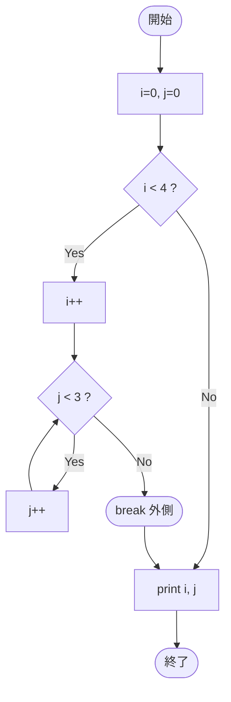

# Test0561 — フローチャートとトレース表

- 対象ファイル: `src/vol06_02/Test0561.java`
- パッケージ: `vol06_02`
- テーマ: 二重 `while` ループ、内側ループ終了後に外側を `break`。

## ソースの要点

```java
int i = 0, j = 0;
while (i < 4) {
    i++;
    while (j < 3) {
        j++;
    }
    break;
}
System.out.println(i);
System.out.println(j);
```

## フローチャート



## トレース表

| ステップ | i | j | 評価 | 動作 |
|----|----|----|----|----|
| 1 | 0 | 0 | `i<4` true | 外側に入る |
| 2 | 1 | 0 | `i++` 後 | - |
| 3 | 1 | 1 | `j<3` true → `j++` | - |
| 4 | 1 | 2 | `j<3` true → `j++` | - |
| 5 | 1 | 3 | `j<3` true → `j++` | - |
| 6 | 1 | 3 | `j<3` false | 内側終了 |
| 7 | 1 | 3 | - | `break` で外側終了 |
| 8 | 1 | 3 | - | print 1, print 3 |

## 実行結果（標準出力）

```
1
3
```

## 学習ポイント

- 外側ループは `break` で 1 回しか回らない。`i` は 1 にしかならない。
- 内側 `while(j < 3)` は j を 0→3 まで増やしてから終了。
- `break` はラベル省略時、最も内側の `while`/`for`/`switch` を抜けるが、ここでは内側ループは既に終わっており、`break` 文の位置から外側 while を抜ける。
