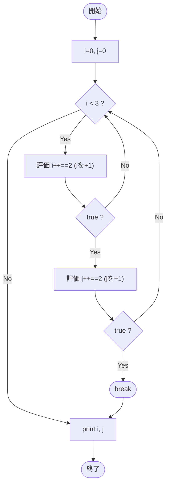

# Test0563 — フローチャートとトレース表

- 対象ファイル: `src/vol06_02/Test0563.java`
- パッケージ: `vol06_02`
- テーマ: `&&` の短絡評価と後置インクリメントの組み合わせ。

## ソースの要点

```java
int i, j;
for (i = 0, j = 0; i < 3;) {
    if (i++ == 2 && j++ == 2)
        break;
}
System.out.println(i);
System.out.println(j);
```

## フローチャート



## トレース表

| 反復 | 開始 i | i<3? | i++ の値 | i++後 | ==2? | 短絡で j 評価する? | j++ の値 | j++後 | 動作 |
|----|----|----|----|----|----|----|----|----|----|
| 1 | 0 | true | 0 | 1 | false | no（短絡で j 未評価） | - | 0 | 続行 |
| 2 | 1 | true | 1 | 2 | false | no | - | 0 | 続行 |
| 3 | 2 | true | 2 | 3 | true | yes | 0 | 1 | 0==2 false → 続行 |
| 4 | 3 | false | - | - | - | - | - | 1 | ループ終了 |

最終 i=3, j=1。

## 実行結果（標準出力）

```
3
1
```

## 学習ポイント

- `&&` は左辺が false なら右辺を評価しない（短絡評価）。
- 反復 1, 2 では `i++ == 2` が false なので `j++` は実行されない。j は 0 のまま。
- 反復 3 で初めて `i++ == 2` が true となり `j++ == 2` を評価。`j++` の値は 0 で false。
- 反復 3 で i は 3 になり、次の条件 `i < 3` が false になりループ終了。
- 同じ式でも `||` (Test0562) と `&&` (Test0563) で結果が大きく変わる。
